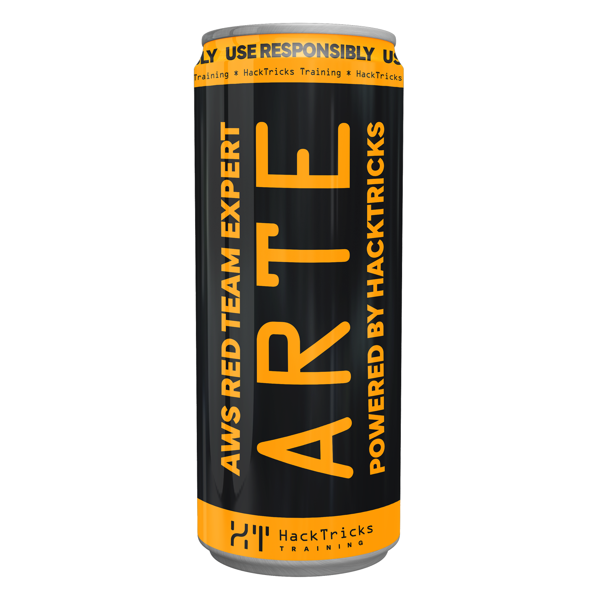

# macOS - AMFI - AppleMobileFileIntegrity


Learn & practice AWS Hacking:[**HackTricks Training AWS Red Team Expert (ARTE)**](https://training.hacktricks.xyz/courses/arte)\
Learn & practice GCP Hacking: [**HackTricks Training GCP Red Team Expert (GRTE)**](https://training.hacktricks.xyz/courses/grte)

<details>

<summary>Support HackTricks</summary>

* Check the [**subscription plans**](https://github.com/sponsors/carlospolop)!
* **Join the** 💬 [**Discord group**](https://discord.gg/hRep4RUj7f) or the [**telegram group**](https://t.me/peass) or **follow** us on **Twitter** 🐦 [**@hacktricks\_live**](https://twitter.com/hacktricks\_live)**.**
* **Share hacking tricks by submitting PRs to the** [**HackTricks**](https://github.com/carlospolop/hacktricks) and [**HackTricks Cloud**](https://github.com/carlospolop/hacktricks-cloud) github repos.

</details>



## AppleMobileFileIntegrity.kext et amfid

Il se concentre sur l'application de l'intégrité du code exécuté sur le système, fournissant la logique derrière la vérification de la signature du code de XNU. Il est également capable de vérifier les droits et de gérer d'autres tâches sensibles telles que l'autorisation de débogage ou l'obtention de ports de tâche.

De plus, pour certaines opérations, le kext préfère contacter le démon en espace utilisateur `/usr/libexec/amfid`. Cette relation de confiance a été abusée dans plusieurs jailbreaks.

AMFI utilise des politiques **MACF** et enregistre ses hooks au moment de son démarrage. De plus, empêcher son chargement ou son déchargement pourrait déclencher un kernel panic. Cependant, il existe certains arguments de démarrage qui permettent de débiliter AMFI :

* `amfi_unrestricted_task_for_pid`: Autoriser task\_for\_pid sans les droits requis
* `amfi_allow_any_signature`: Autoriser toute signature de code
* `cs_enforcement_disable`: Argument système utilisé pour désactiver l'application de la signature de code
* `amfi_prevent_old_entitled_platform_binaries`: Annuler les binaires de plateforme avec des droits
* `amfi_get_out_of_my_way`: Désactive complètement amfi

Voici quelques-unes des politiques MACF qu'il enregistre :

* **`cred_check_label_update_execve:`** La mise à jour de l'étiquette sera effectuée et renverra 1
* **`cred_label_associate`**: Met à jour le slot d'étiquette mac d'AMFI avec l'étiquette
* **`cred_label_destroy`**: Supprime le slot d'étiquette mac d'AMFI
* **`cred_label_init`**: Déplace 0 dans le slot d'étiquette mac d'AMFI
* **`cred_label_update_execve`:** Il vérifie les droits du processus pour voir s'il doit être autorisé à modifier les étiquettes.
* **`file_check_mmap`:** Il vérifie si mmap acquiert de la mémoire et la définit comme exécutable. Dans ce cas, il vérifie si la validation de la bibliothèque est nécessaire et, si c'est le cas, appelle la fonction de validation de la bibliothèque.
* **`file_check_library_validation`**: Appelle la fonction de validation de la bibliothèque qui vérifie, entre autres, si un binaire de plateforme charge un autre binaire de plateforme ou si le processus et le nouveau fichier chargé ont le même TeamID. Certains droits permettront également de charger n'importe quelle bibliothèque.
* **`policy_initbsd`**: Configure les clés NVRAM de confiance
* **`policy_syscall`**: Il vérifie les politiques DYLD, comme si le binaire a des segments non restreints, s'il doit autoriser les variables d'environnement... cela est également appelé lorsqu'un processus est démarré via `amfi_check_dyld_policy_self()`.
* **`proc_check_inherit_ipc_ports`**: Il vérifie si, lorsqu'un processus exécute un nouveau binaire, d'autres processus ayant des droits SEND sur le port de tâche du processus doivent les conserver ou non. Les binaires de plateforme sont autorisés, le droit `get-task-allow` le permet, les droits `task_for_pid-allow` sont autorisés et les binaires avec le même TeamID.
* **`proc_check_expose_task`**: applique les droits
* **`amfi_exc_action_check_exception_send`**: Un message d'exception est envoyé au débogueur
* **`amfi_exc_action_label_associate & amfi_exc_action_label_copy/populate & amfi_exc_action_label_destroy & amfi_exc_action_label_init & amfi_exc_action_label_update`**: Cycle de vie de l'étiquette lors du traitement des exceptions (débogage)
* **`proc_check_get_task`**: Vérifie les droits comme `get-task-allow` qui permet à d'autres processus d'obtenir le port de tâches et `task_for_pid-allow`, qui permet au processus d'obtenir les ports de tâches d'autres processus. Si aucun de ceux-ci, il appelle `amfid permitunrestricteddebugging` pour vérifier si c'est autorisé.
* **`proc_check_mprotect`**: Refuser si `mprotect` est appelé avec le drapeau `VM_PROT_TRUSTED` qui indique que la région doit être traitée comme si elle avait une signature de code valide.
* **`vnode_check_exec`**: Est appelé lorsque des fichiers exécutables sont chargés en mémoire et définit `cs_hard | cs_kill` qui tuera le processus si l'une des pages devient invalide
* **`vnode_check_getextattr`**: MacOS: Vérifie `com.apple.root.installed` et `isVnodeQuarantined()`
* **`vnode_check_setextattr`**: Comme get + com.apple.private.allow-bless et droit équivalent d'installateur interne
* &#x20;**`vnode_check_signature`**: Code qui appelle XNU pour vérifier la signature du code en utilisant des droits, un cache de confiance et `amfid`
* &#x20;**`proc_check_run_cs_invalid`**: Il intercepte les appels `ptrace()` (`PT_ATTACH` et `PT_TRACE_ME`). Il vérifie pour l'un des droits `get-task-allow`, `run-invalid-allow` et `run-unsigned-code` et si aucun, il vérifie si le débogage est autorisé.
* **`proc_check_map_anon`**: Si mmap est appelé avec le drapeau **`MAP_JIT`**, AMFI vérifiera le droit `dynamic-codesigning`.

`AMFI.kext` expose également une API pour d'autres extensions du noyau, et il est possible de trouver ses dépendances avec :
```bash
kextstat | grep " 19 " | cut -c2-5,50- | cut -d '(' -f1
Executing: /usr/bin/kmutil showloaded
No variant specified, falling back to release
8   com.apple.kec.corecrypto
19   com.apple.driver.AppleMobileFileIntegrity
22   com.apple.security.sandbox
24   com.apple.AppleSystemPolicy
67   com.apple.iokit.IOUSBHostFamily
70   com.apple.driver.AppleUSBTDM
71   com.apple.driver.AppleSEPKeyStore
74   com.apple.iokit.EndpointSecurity
81   com.apple.iokit.IOUserEthernet
101   com.apple.iokit.IO80211Family
102   com.apple.driver.AppleBCMWLANCore
118   com.apple.driver.AppleEmbeddedUSBHost
134   com.apple.iokit.IOGPUFamily
135   com.apple.AGXG13X
137   com.apple.iokit.IOMobileGraphicsFamily
138   com.apple.iokit.IOMobileGraphicsFamily-DCP
162   com.apple.iokit.IONVMeFamily
```
## amfid

C'est le démon en mode utilisateur que `AMFI.kext` utilisera pour vérifier les signatures de code en mode utilisateur.\
Pour que `AMFI.kext` communique avec le démon, il utilise des messages mach via le port `HOST_AMFID_PORT`, qui est le port spécial `18`.

Notez qu'il n'est plus possible pour les processus root de détourner des ports spéciaux sous macOS, car ils sont protégés par `SIP` et seul launchd peut y accéder. Dans iOS, il est vérifié que le processus renvoyant la réponse a le CDHash codé en dur de `amfid`.

Il est possible de voir quand `amfid` est demandé pour vérifier un binaire et la réponse de celui-ci en le déboguant et en plaçant un point d'arrêt dans `mach_msg`.

Une fois qu'un message est reçu via le port spécial, **MIG** est utilisé pour envoyer chaque fonction à la fonction qu'il appelle. Les principales fonctions ont été inversées et expliquées dans le livre.

## Profils de Provisionnement

Un profil de provisionnement peut être utilisé pour signer du code. Il existe des profils **Développeur** qui peuvent être utilisés pour signer du code et le tester, et des profils **Entreprise** qui peuvent être utilisés sur tous les appareils.

Après qu'une application soit soumise à l'Apple Store, si elle est approuvée, elle est signée par Apple et le profil de provisionnement n'est plus nécessaire.

Un profil utilise généralement l'extension `.mobileprovision` ou `.provisionprofile` et peut être extrait avec :
```bash
openssl asn1parse -inform der -in /path/to/profile

# Or

security cms -D -i /path/to/profile
```
Bien que parfois appelés certifiés, ces profils de provisioning ont plus qu'un certificat :

* **AppIDName :** L'identifiant de l'application
* **AppleInternalProfile :** Désigne ceci comme un profil interne à Apple
* **ApplicationIdentifierPrefix :** Préfixé à AppIDName (identique à TeamIdentifier)
* **CreationDate :** Date au format `YYYY-MM-DDTHH:mm:ssZ`
* **DeveloperCertificates :** Un tableau de certificat(s) (généralement un), encodé en données Base64
* **Entitlements :** Les droits autorisés avec les droits pour ce profil
* **ExpirationDate :** Date d'expiration au format `YYYY-MM-DDTHH:mm:ssZ`
* **Name :** Le nom de l'application, identique à AppIDName
* **ProvisionedDevices :** Un tableau (pour les certificats de développeur) de UDIDs pour lesquels ce profil est valide
* **ProvisionsAllDevices :** Un booléen (vrai pour les certificats d'entreprise)
* **TeamIdentifier :** Un tableau de chaîne(s) alphanumérique(s) (généralement une) utilisée(s) pour identifier le développeur à des fins d'interaction entre applications
* **TeamName :** Un nom lisible par l'homme utilisé pour identifier le développeur
* **TimeToLive :** Validité (en jours) du certificat
* **UUID :** Un identifiant unique universel pour ce profil
* **Version :** Actuellement défini sur 1

Notez que l'entrée des droits contiendra un ensemble restreint de droits et le profil de provisioning ne pourra donner que ces droits spécifiques pour éviter de donner des droits privés à Apple.

Notez que les profils sont généralement situés dans `/var/MobileDeviceProvisioningProfiles` et il est possible de les vérifier avec **`security cms -D -i /path/to/profile`**

## **libmis.dyld**

C'est la bibliothèque externe que `amfid` appelle pour demander s'il doit autoriser quelque chose ou non. Cela a été historiquement abusé dans le jailbreak en exécutant une version backdoorée qui permettrait tout.

Dans macOS, cela se trouve dans `MobileDevice.framework`.

## Caches de confiance AMFI

iOS AMFI maintient une liste de hachages connus qui sont signés ad-hoc, appelée **Trust Cache** et trouvée dans la section `__TEXT.__const` du kext. Notez que dans des opérations très spécifiques et sensibles, il est possible d'étendre ce Trust Cache avec un fichier externe.

## Références

* [**\*OS Internals Volume III**](https://newosxbook.com/home.html)


Learn & practice AWS Hacking:[**HackTricks Training AWS Red Team Expert (ARTE)**](https://training.hacktricks.xyz/courses/arte)\
Learn & practice GCP Hacking: [**HackTricks Training GCP Red Team Expert (GRTE)**](https://training.hacktricks.xyz/courses/grte)

<details>

<summary>Support HackTricks</summary>

* Check the [**subscription plans**](https://github.com/sponsors/carlospolop)!
* **Join the** 💬 [**Discord group**](https://discord.gg/hRep4RUj7f) or the [**telegram group**](https://t.me/peass) or **follow** us on **Twitter** 🐦 [**@hacktricks\_live**](https://twitter.com/hacktricks\_live)**.**
* **Share hacking tricks by submitting PRs to the** [**HackTricks**](https://github.com/carlospolop/hacktricks) and [**HackTricks Cloud**](https://github.com/carlospolop/hacktricks-cloud) github repos.

</details>

