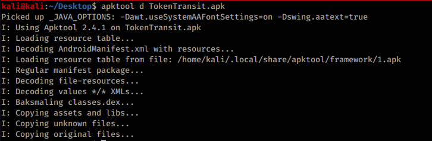
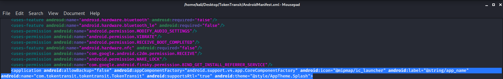
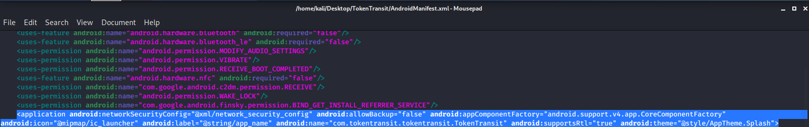
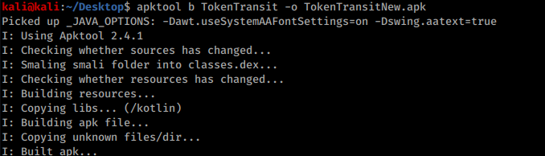


Learn & practice AWS Hacking:[**HackTricks Training AWS Red Team Expert (ARTE)**](https://training.hacktricks.xyz/courses/arte)\
Learn & practice GCP Hacking: [**HackTricks Training GCP Red Team Expert (GRTE)**](https://training.hacktricks.xyz/courses/grte)

<details>

<summary>Support HackTricks</summary>

* Check the [**subscription plans**](https://github.com/sponsors/carlospolop)!
* **Join the** 💬 [**Discord group**](https://discord.gg/hRep4RUj7f) or the [**telegram group**](https://t.me/peass) or **follow** us on **Twitter** 🐦 [**@hacktricks\_live**](https://twitter.com/hacktricks\_live)**.**
* **Share hacking tricks by submitting PRs to the** [**HackTricks**](https://github.com/carlospolop/hacktricks) and [**HackTricks Cloud**](https://github.com/carlospolop/hacktricks-cloud) github repos.

</details>


Sommige toepassings hou nie van gebruikersafgelaaide sertifikate nie, so om webverkeer vir sommige toepassings te inspekteer, moet ons eintlik die toepassing dekompileer, 'n paar dinge byvoeg en dit weer compileer.

# Outomaties

Die hulpmiddel [**https://github.com/shroudedcode/apk-mitm**](https://github.com/shroudedcode/apk-mitm) sal **outomaties** die nodige veranderinge aan die toepassing maak om die versoeke te begin vasvang en sal ook sertifikaat-pinning deaktiveer (indien enige).

# Handmatig

Eerstens dekompileer ons die app: `apktool d *file-name*.apk`



Dan gaan ons in die **Manifest.xml**-lêer en blaai af na die `<\application android>`-etiket en ons gaan die volgende lyn byvoeg as dit nog nie daar is nie:

`android:networkSecurityConfig="@xml/network_security_config"`

Voor die toevoeging:



Na die toevoeging:



Gaan nou in die **res/xml**-map en skep/wysig 'n lêer genaamd network\_security\_config.xml met die volgende inhoud:
```markup
<network-security-config>
<base-config>
<trust-anchors>
<!-- Trust preinstalled CAs -->
<certificates src="system" />
<!-- Additionally trust user added CAs -->
<certificates src="user" />
</trust-anchors>
</base-config>
</network-security-config>
```
Dan stoor die lêer en gaan uit al die gidse en herbou die apk met die volgende opdrag: `apktool b *folder-name/* -o *output-file.apk*`



Laastens, jy moet net die **nuwe aansoek teken**. [Lees hierdie afdeling van die bladsy Smali - Decompiling/\[Modifying\]/Compiling om te leer hoe om dit te teken](smali-changes.md#sing-the-new-apk).


Leer en oefen AWS Hacking:[**HackTricks Training AWS Red Team Expert (ARTE)**](https://training.hacktricks.xyz/courses/arte)\
Leer en oefen GCP Hacking: [**HackTricks Training GCP Red Team Expert (GRTE)**](https://training.hacktricks.xyz/courses/grte)

<details>

<summary>Ondersteun HackTricks</summary>

* Kyk na die [**subskripsie planne**](https://github.com/sponsors/carlospolop)!
* **Sluit aan by die** 💬 [**Discord-groep**](https://discord.gg/hRep4RUj7f) of die [**telegram-groep**](https://t.me/peass) of **volg** ons op **Twitter** 🐦 [**@hacktricks\_live**](https://twitter.com/hacktricks\_live)**.**
* **Deel hacking truuks deur PRs in te dien na die** [**HackTricks**](https://github.com/carlospolop/hacktricks) en [**HackTricks Cloud**](https://github.com/carlospolop/hacktricks-cloud) github repos.

</details>

